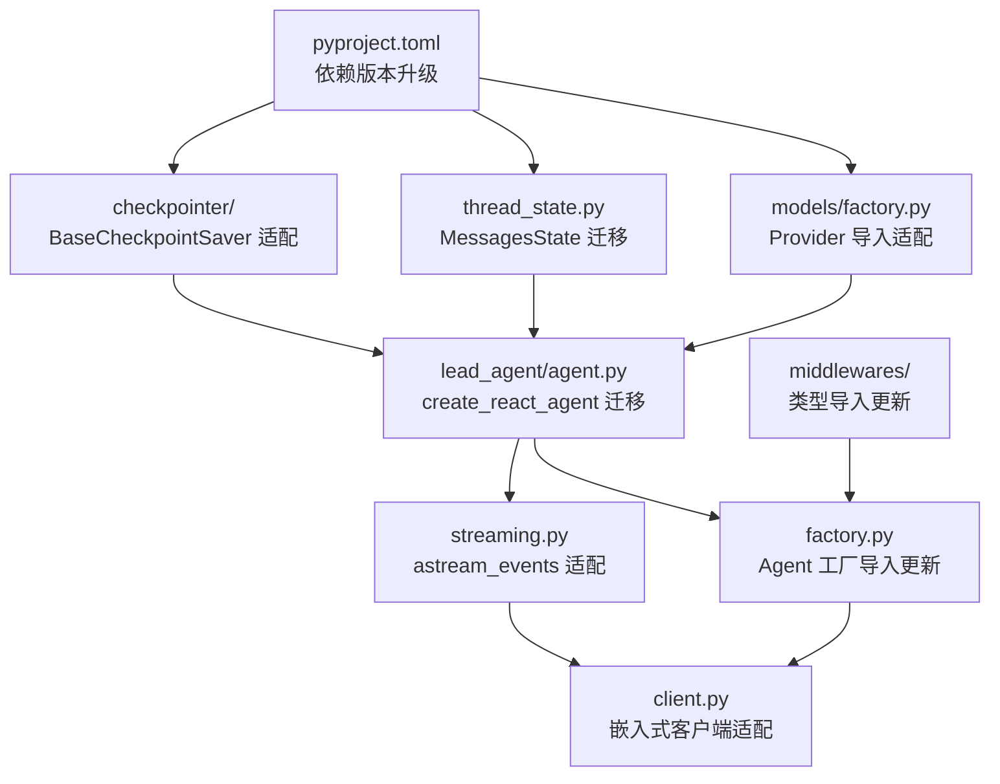

# Design Document: LangChain v1.0 升级

## Overview

本设计文档描述将 hn-agent 项目的 Agent 核心模块从 LangChain v0.3+ / LangGraph v0.4+ 迁移到 LangChain v1.0 / LangGraph v1.0 的技术方案。

迁移范围涵盖 9 个核心模块：
1. **依赖声明** (`pyproject.toml`) — 版本约束升级
2. **Lead Agent** (`lead_agent/agent.py`) — `create_react_agent` API 迁移
3. **流式响应** (`streaming.py`) — `astream_events` 适配
4. **检查点系统** (`checkpointer/`) — `BaseCheckpointSaver` 接口适配
5. **线程状态** (`thread_state.py`) — `MessagesState` / 消息类型迁移
6. **Agent 工厂** (`factory.py`) — 组装流程导入路径更新
7. **嵌入式客户端** (`client.py`) — Agent 调用接口适配
8. **模型工厂** (`models/factory.py`) — Provider 包导入适配
9. **中间件链** (`middlewares/`) — LangChain 类型导入更新

### 设计原则

- **最小变更原则**：仅修改因 API 变更而必须修改的代码，保持业务逻辑不变
- **向前兼容**：优先使用 LangChain v1.0 推荐的新 API，不保留废弃调用
- **渐进式迁移**：按依赖关系从底层（依赖/模型工厂）到上层（Agent/客户端）逐步迁移
- **测试驱动**：每个模块迁移后通过单元测试验证正确性

## Architecture

### 迁移影响拓扑



### 迁移顺序

按依赖拓扑排序，自底向上迁移：

| 阶段 | 模块 | 依赖 |
|------|------|------|
| 1 | `pyproject.toml` | 无 |
| 2 | `models/` Provider | pyproject.toml |
| 3 | `thread_state.py` | pyproject.toml |
| 4 | `checkpointer/` | pyproject.toml |
| 5 | `lead_agent/agent.py` | models, thread_state, checkpointer |
| 6 | `middlewares/` | pyproject.toml |
| 7 | `streaming.py` | lead_agent |
| 8 | `factory.py` | lead_agent, middlewares |
| 9 | `client.py` | factory, streaming |

## Components and Interfaces

### 1. 依赖版本变更 (`pyproject.toml`)

当前版本 → 目标版本：

| 包名 | 当前 | 目标 |
|------|------|------|
| `langchain` | `>=0.3.0` | `>=1.0.0` |
| `langchain-core` | `>=0.3.0` | `>=1.0.0` |
| `langchain-openai` | `>=0.3.0` | `>=1.0.0` |
| `langchain-anthropic` | `>=0.3.0` | `>=1.0.0` |
| `langchain-google-genai` | `>=2.0.0` | `>=2.1.0` |
| `langchain-community` | `>=0.3.0` | `>=1.0.0` |
| `langgraph` | `>=0.4.0` | `>=0.5.0` |

Python 版本要求保持 `>=3.12`（已满足 v1.0 的 `>=3.10` 要求）。

### 1. 依赖版本变更 (`pyproject.toml`)

当前版本 → 目标版本：

| 包名 | 当前 | 目标 |
|------|------|------|
| `langchain` | `>=0.3.0` | `>=1.0.0` |
| `langchain-core` | `>=0.3.0` | `>=1.0.0` |
| `langchain-openai` | `>=0.3.0` | `>=1.0.0` |
| `langchain-anthropic` | `>=0.3.0` | `>=1.0.0` |
| `langchain-google-genai` | `>=2.0.0` | `>=2.1.0` |
| `langchain-community` | `>=0.3.0` | `>=1.0.0` |
| `langgraph` | `>=0.4.0` | `>=1.0.0` |

Python 版本要求保持 `>=3.12`（已满足 v1.0 的 `>=3.10` 要求）。

### 2. Lead Agent 创建 (`lead_agent/agent.py`)

**当前实现：**
```python
from langgraph.prebuilt import create_react_agent

agent = create_react_agent(
    model=model,
    tools=tools,
    prompt=system_prompt,        # v0.3 参数名
    checkpointer=checkpointer,
)
```

**迁移方案：**
LangChain v1.0 引入了全新的 `create_agent` 函数（位于 `langchain.agents`），替代 `langgraph.prebuilt.create_react_agent`（后者在 LangGraph v1.0 中已被废弃）。

关键 API 变化：
- **导入路径**: `langgraph.prebuilt.create_react_agent` → `langchain.agents.create_agent`
- **参数名**: `prompt` → `system_prompt`
- **model 参数**: 支持字符串标识符（如 `"openai:gpt-4o"`）或 `BaseChatModel` 实例
- **新增 middleware 参数**: 原生中间件系统（本次迁移暂不使用）
- **新增 context_schema 参数**: 运行时上下文注入
- **流式节点名**: `"agent"` → `"model"`

```python
from langchain.agents import create_agent

agent = create_agent(
    model=model,                     # BaseChatModel 实例或字符串标识符
    tools=tools,
    system_prompt=system_prompt,     # v1.0 参数名（原 prompt）
    checkpointer=checkpointer,
)
```

**设计决策**：迁移到 `langchain.agents.create_agent`，这是 LangChain v1.0 推荐的标准 Agent 构建方式。`create_lead_agent` 函数签名保持不变：`create_lead_agent(model, tools, system_prompt, checkpointer) -> CompiledStateGraph`。

### 3. 流式响应 (`streaming.py`)

**当前实现：**
```python
async for event in agent.astream_events(input_data, config=config, version="v2"):
```

**迁移方案：**
LangChain v1.0 中 `astream_events` 的 `version` 参数可能被移除（v2 成为默认）或保持不变。需要：
- 移除显式 `version="v2"` 参数（如果 v1.0 默认即为 v2）
- 验证事件类型名称是否变更（`on_chat_model_stream`, `on_tool_start`, `on_tool_end`）

```python
async for event in agent.astream_events(input_data, config=config):
```

**设计决策**：事件映射逻辑 (`_map_langgraph_event`) 保持不变，仅调整 `astream_events` 调用参数。SSEEvent 数据模型和事件类型不受影响。

### 4. 检查点系统 (`checkpointer/`)

**当前实现：**
```python
from langgraph.checkpoint.base import (
    BaseCheckpointSaver, Checkpoint, CheckpointMetadata,
    CheckpointTuple, ChannelVersions,
)
from langgraph.checkpoint.sqlite import SqliteSaver
from langgraph.checkpoint.sqlite.aio import AsyncSqliteSaver
```

**迁移方案：**
LangGraph v1.0 中检查点相关类型可能有以下变更：
- `BaseCheckpointSaver` 方法签名可能调整（如 `put_writes` 的 `task_path` 参数）
- `Checkpoint`, `CheckpointMetadata`, `ChannelVersions` 类型定义可能更新
- 导入路径可能变更

需要验证并适配：
1. `BaseCheckpointSaver` 抽象方法签名
2. `SqliteSaver` / `AsyncSqliteSaver` 构造函数
3. 类型导入路径

**设计决策**：保持 `SQLiteCheckpointer` 和 `AsyncSQLiteCheckpointer` 的委托模式不变，仅更新导入路径和方法签名以匹配 v1.0 接口。容错逻辑（损坏数据返回 None）保持不变。

### 5. 线程状态 (`thread_state.py`)

**当前实现：**
```python
from langgraph.graph import MessagesState
from langchain_core.messages import (
    BaseMessage, HumanMessage, AIMessage, SystemMessage, ToolMessage,
    messages_from_dict, message_to_dict,
)
```

**迁移方案：**
- `MessagesState` 在 LangGraph v1.0 中可能从 `langgraph.graph` 移到其他位置
- `langchain_core.messages` 中的消息类型在 v1.0 中可能迁移到 `langchain.messages`
- `message_to_dict` / `messages_from_dict` 可能被重命名或移动

需要验证并更新导入路径。`ThreadState` 的自定义字段（`artifacts`, `images`, `title`, `thread_data`）和 reducer 逻辑不受影响。

**设计决策**：`ThreadState` 继续使用 TypedDict 风格的 `MessagesState` 继承（LangChain v1.0 推荐 TypedDict）。自定义 reducer 和数据模型（`Artifact`, `ImageData`）保持不变。

### 6. Agent 工厂 (`factory.py`)

**迁移方案：**
- 更新 `CompiledStateGraph` 导入路径（如果变更）
- 确保 `create_lead_agent` 和 `create_model` 调用与 v1.0 兼容
- 无业务逻辑变更

### 7. 嵌入式客户端 (`client.py`)

**迁移方案：**
- `HumanMessage` 导入路径可能从 `langchain_core.messages` 变为 `langchain.messages`
- `stream_agent_response` 和 `make_lead_agent` 的接口不变（由上游模块保证）

### 8. 模型工厂 Provider (`models/`)

**迁移方案：**
各 Provider 的导入路径在 v1.0 中可能变更：

| Provider | 当前导入 | v1.0 导入 |
|----------|---------|-----------|
| OpenAI | `langchain_openai.ChatOpenAI` | `langchain_openai.ChatOpenAI`（预计不变） |
| Anthropic | `langchain_anthropic.ChatAnthropic` | `langchain_anthropic.ChatAnthropic`（预计不变） |
| Google | `langchain_google_genai.ChatGoogleGenerativeAI` | `langchain_google_genai.ChatGoogleGenerativeAI`（预计不变） |
| Base | `langchain_core.language_models.BaseChatModel` | `langchain_core.language_models.BaseChatModel`（预计不变） |

**设计决策**：Provider 包（`langchain-openai`, `langchain-anthropic` 等）通常保持向后兼容的导入路径。主要变更在于构造函数参数，需要验证各 Provider 类的 v1.0 构造函数签名。

### 9. 中间件链 (`middlewares/`)

**迁移方案：**
当前 14 个中间件均使用 `dict[str, Any]` 作为 state 和 config 类型，不直接导入 LangChain 类型。`Middleware` Protocol 和 `MiddlewareChain` 不需要修改。

如果未来中间件实现中引入了 LangChain 消息类型（如 `SummarizationMiddleware` 调用 LLM），需要更新对应导入路径。当前所有中间件均为 TODO 桩实现，无需修改。

**设计决策**：中间件系统保持当前自定义 Protocol 模式，不迁移到 LangChain v1.0 原生 `AgentMiddleware`。原因：
1. 当前中间件在 Agent 推理前后执行（pre/post），与 LangChain v1.0 `AgentMiddleware` 的钩子模型不同
2. 14 个中间件已有明确的执行顺序和职责划分
3. 迁移到原生中间件需要重写所有中间件，风险大且收益有限


## Data Models

### 变更影响的数据模型

#### 1. ThreadState（线程状态 Schema）

```python
# 当前：继承 langgraph.graph.MessagesState
class ThreadState(MessagesState):
    artifacts: Annotated[list[Artifact], artifacts_reducer]
    images: Annotated[list[ImageData], operator.add]
    title: str | None
    thread_data: dict[str, Any]
```

v1.0 迁移后结构不变，仅更新 `MessagesState` 的导入路径。`ThreadState` 使用 TypedDict 风格，与 LangChain v1.0 推荐的 TypedDict-only state schema 兼容。

#### 2. Artifact / ImageData

这两个 dataclass 不依赖任何 LangChain 类型，迁移无影响。

#### 3. SSEEvent

```python
@dataclass
class SSEEvent:
    event: str  # "token" | "tool_call" | "tool_result" | "done" | ...
    data: dict[str, Any]
```

不依赖 LangChain 类型，迁移无影响。

#### 4. 消息类型

```python
# 当前导入
from langchain_core.messages import (
    BaseMessage, HumanMessage, AIMessage, SystemMessage, ToolMessage,
    messages_from_dict, message_to_dict,
)
```

v1.0 中这些类型可能迁移到 `langchain.messages`。需要验证并更新所有使用这些类型的文件：
- `thread_state.py` — 序列化/反序列化
- `client.py` — 构造 `HumanMessage`

#### 5. 检查点类型

```python
# 当前导入
from langgraph.checkpoint.base import (
    Checkpoint, CheckpointMetadata, CheckpointTuple, ChannelVersions,
)
```

v1.0 中这些类型定义可能更新。需要验证类型签名并适配 `SQLiteCheckpointer` 和 `AsyncSQLiteCheckpointer` 的方法参数。

#### 6. AgentConfig / Features

```python
@dataclass
class AgentConfig:
    agent_id: str
    name: str
    model_name: str
    features: Features
    # ...

@dataclass
class Features:
    sandbox_enabled: bool
    memory_enabled: bool
    # ...
```

纯 Python dataclass，不依赖 LangChain 类型，迁移无影响。

### 导入路径变更汇总

| 类型/函数 | 当前路径 | v1.0 路径 | 影响文件 |
|-----------|---------|--------------|---------|
| `create_react_agent` | `langgraph.prebuilt` | `langchain.agents.create_agent` | `lead_agent/agent.py` |
| `AgentState` | N/A | `langchain.agents.AgentState`（新增） | `thread_state.py` |
| `MessagesState` | `langgraph.graph` | `langgraph.graph`（保持，但推荐用 AgentState） | `thread_state.py` |
| `CompiledStateGraph` | `langgraph.graph.state` | `langgraph.graph.state`（保持） | `factory.py`, `streaming.py`, `lead_agent/agent.py` |
| `BaseCheckpointSaver` | `langgraph.checkpoint.base` | `langgraph.checkpoint.base`（保持） | `checkpointer/*.py`, `lead_agent/agent.py` |
| `SqliteSaver` | `langgraph.checkpoint.sqlite` | `langgraph.checkpoint.sqlite`（保持） | `checkpointer/provider.py` |
| `AsyncSqliteSaver` | `langgraph.checkpoint.sqlite.aio` | `langgraph.checkpoint.sqlite.aio`（保持） | `checkpointer/async_provider.py` |
| `BaseChatModel` | `langchain_core.language_models` | `langchain_core.language_models`（保持） | `models/*.py`, `lead_agent/agent.py` |
| `BaseTool` | `langchain_core.tools` | `langchain_core.tools`（保持） | `tools/loader.py`, `lead_agent/agent.py` |
| `HumanMessage` 等 | `langchain_core.messages` | `langchain_core.messages`（保持，也可从 `langchain.messages` 导入） | `thread_state.py`, `client.py` |
| `message_to_dict` | `langchain_core.messages` | `langchain_core.messages`（保持） | `thread_state.py` |
| `ChatOpenAI` | `langchain_openai` | `langchain_openai`（保持） | `models/openai_provider.py` |
| `ChatAnthropic` | `langchain_anthropic` | `langchain_anthropic`（保持） | `models/anthropic_provider.py` |
| `ChatGoogleGenerativeAI` | `langchain_google_genai` | `langchain_google_genai`（保持） | `models/google_provider.py` |


## Correctness Properties

*A property is a characteristic or behavior that should hold true across all valid executions of a system — essentially, a formal statement about what the system should do. Properties serve as the bridge between human-readable specifications and machine-verifiable correctness guarantees.*

### Property 1: Lead Agent 返回类型正确性

*For any* valid `BaseChatModel` instance, any list of `BaseTool` instances, any non-empty system prompt string, and any optional `BaseCheckpointSaver`, calling `create_lead_agent` should return an instance of `CompiledStateGraph`.

**Validates: Requirements 2.5**

### Property 2: 流式事件映射正确性

*For any* LangGraph 事件字典，当事件类型为 `on_chat_model_stream` 时映射结果的 `event` 字段应为 `"token"` 且 `data` 包含 `"content"` 键；当事件类型为 `on_tool_start` 时映射结果的 `event` 字段应为 `"tool_call"` 且 `data` 包含 `"tool_name"` 和 `"input"` 键；当事件类型为 `on_tool_end` 时映射结果的 `event` 字段应为 `"tool_result"` 且 `data` 包含 `"tool_name"` 和 `"output"` 键。

**Validates: Requirements 3.3, 3.4, 3.5**

### Property 3: 流式响应终止事件

*For any* 成功完成的 Agent 流式推理过程，`stream_agent_response` 产生的最后一个 SSE 事件的 `event` 字段应为 `"done"` 且 `data` 包含 `{"finished": true}`。

**Validates: Requirements 3.6**

### Property 4: 检查点损坏容错

*For any* 导致反序列化失败的损坏检查点数据，`SQLiteCheckpointer.get_tuple` 应返回 `None` 而不是抛出异常。

**Validates: Requirements 4.5**

### Property 5: 消息序列化往返一致性

*For any* 包含任意数量 `HumanMessage`、`AIMessage`、`SystemMessage`、`ToolMessage` 的消息列表，对每条消息执行 `message_to_dict` 后再通过 `messages_from_dict` 反序列化，应得到与原始消息内容等价的消息列表。

**Validates: Requirements 5.3**

### Property 6: Artifacts Reducer 合并正确性

*For any* 已有 artifact 列表和新 artifact 列表，`artifacts_reducer` 应满足：(a) 新 artifact 的 ID 已存在于已有列表中时，对应位置被替换为新 artifact；(b) 新 artifact 的 ID 不存在时，追加到结果末尾；(c) 结果列表中每个 ID 唯一。

**Validates: Requirements 5.5**

### Property 7: 中间件执行顺序

*For any* 中间件列表，`MiddlewareChain.run_pre` 应按列表正序调用每个中间件的 `pre_process`，`MiddlewareChain.run_post` 应按列表逆序调用每个中间件的 `post_process`。

**Validates: Requirements 9.1**

### Property 8: 检查点持久化往返一致性

*For any* 有效的 `Checkpoint` 和 `CheckpointMetadata`，通过 `SQLiteCheckpointer.put` 存储后再通过 `get_tuple` 读取，应得到与原始数据等价的 `CheckpointTuple`。

**Validates: Requirements 11.3**

## Error Handling

### 错误处理策略

迁移过程中的错误处理遵循以下原则：

1. **导入错误**：如果 v1.0 中某个类型的导入路径变更，Python 会在 import 时抛出 `ImportError`。这类错误在开发阶段即可发现，不需要运行时处理。

2. **API 签名不匹配**：如果 `create_react_agent` 的参数名变更，调用时会抛出 `TypeError`。`create_lead_agent` 应记录错误日志并向上传播异常。

3. **检查点系统错误**：
   - 写入失败（`put`/`aput`）：记录日志并向上传播异常（数据丢失不可静默）
   - 读取失败（`get_tuple`/`aget_tuple`）：记录日志并返回 `None`（允许从空白状态恢复）
   - 列表查询失败（`list`/`alist`）：记录日志并返回空迭代器

4. **流式响应错误**：
   - `astream_events` 抛出异常时，生成包含错误信息的 `done` 事件
   - 单个事件映射失败时，跳过该事件继续处理

5. **模型创建错误**：
   - Provider 不支持：抛出 `UnsupportedProviderError`
   - 凭证缺失：抛出 `CredentialError`
   - 构造函数参数不匹配：向上传播 `TypeError`

### 降级策略

| 组件 | 错误场景 | 降级行为 |
|------|---------|---------|
| Checkpointer | 数据库连接失败 | Agent 以无状态模式运行 |
| Checkpointer | 数据损坏 | 返回 None，Agent 从空白状态开始 |
| Streaming | 事件映射失败 | 跳过该事件，继续处理后续事件 |
| Streaming | 整体异常 | 发送 error done 事件 |
| Model Factory | Provider 不支持 | 抛出异常，阻止 Agent 创建 |

## Testing Strategy

### 测试框架

- **单元测试**: `pytest` + `pytest-asyncio`
- **属性测试**: `hypothesis`（已在 `pyproject.toml` dev 依赖中声明）
- **Mock**: `unittest.mock` / `pytest-mock`

### 双重测试方法

本迁移采用单元测试 + 属性测试的双重策略：

- **单元测试**：验证具体的迁移示例、导入路径正确性、边界条件
- **属性测试**：验证跨所有输入的通用属性（序列化往返、reducer 正确性、事件映射等）

### 属性测试配置

- 每个属性测试最少运行 **100 次迭代**
- 每个属性测试必须通过注释引用设计文档中的属性编号
- 标签格式：**Feature: agent-langchain-v1-upgrade, Property {number}: {property_text}**
- 每个正确性属性由**单个**属性测试实现
- 使用 `hypothesis` 库的 `@given` 装饰器和 `@settings(max_examples=100)`

### 测试计划

#### 属性测试（Property-Based Tests）

| 属性 | 测试描述 | 生成器 |
|------|---------|--------|
| Property 1 | 验证 `create_lead_agent` 返回 `CompiledStateGraph` | Mock BaseChatModel, 随机工具列表, 随机 prompt |
| Property 2 | 验证 `_map_langgraph_event` 事件映射正确性 | 随机生成 LangGraph 事件字典（含随机 content/tool_name/input/output） |
| Property 3 | 验证流式响应以 done 事件结束 | Mock Agent 产生随机事件序列 |
| Property 4 | 验证损坏检查点返回 None | 随机生成导致反序列化失败的数据 |
| Property 5 | 验证消息序列化往返一致性 | 随机生成 HumanMessage/AIMessage/SystemMessage/ToolMessage 列表 |
| Property 6 | 验证 `artifacts_reducer` 合并逻辑 | 随机生成 Artifact 列表（含重复/不重复 ID） |
| Property 7 | 验证中间件执行顺序 | 随机生成中间件列表，记录调用顺序 |
| Property 8 | 验证检查点持久化往返 | 随机生成 Checkpoint + Metadata |

#### 单元测试（Unit Tests）

| 模块 | 测试描述 |
|------|---------|
| `pyproject.toml` | 验证所有 LangChain 依赖版本约束正确 |
| `lead_agent/agent.py` | 验证 `create_react_agent` 使用正确的导入路径和参数名 |
| `streaming.py` | 验证 `astream_events` 调用不使用废弃参数 |
| `streaming.py` | 验证异常时产生 error done 事件 |
| `checkpointer/` | 验证 `BaseCheckpointSaver` 接口实现完整性 |
| `thread_state.py` | 验证 `ThreadState` 继承自正确的 `MessagesState` |
| `factory.py` | 验证 `make_lead_agent` 默认配置不抛异常 |
| `client.py` | 验证 `HumanMessage` 导入路径正确 |
| `models/` | 验证各 Provider 使用正确的 v1.0 类 |
| `middlewares/` | 验证 `Middleware` Protocol 接口未变更 |

### 测试文件组织

```
tests/
  unit/
    test_lead_agent.py          # Lead Agent 创建测试
    test_streaming.py           # 流式响应测试
    test_checkpointer.py        # 检查点系统测试
    test_thread_state.py        # 线程状态测试
    test_agent_factory.py       # Agent 工厂测试
    test_client.py              # 嵌入式客户端测试
    test_models.py              # 模型工厂测试
    test_middlewares.py         # 中间件链测试
```

属性测试与单元测试共存于同一测试文件中，通过 `@given` 装饰器区分。
