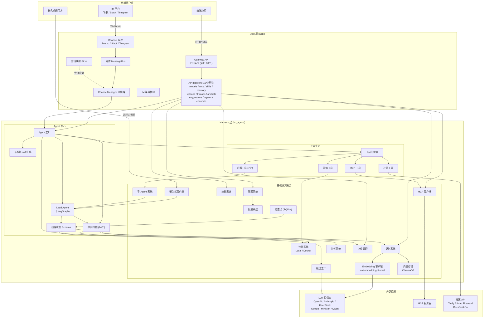
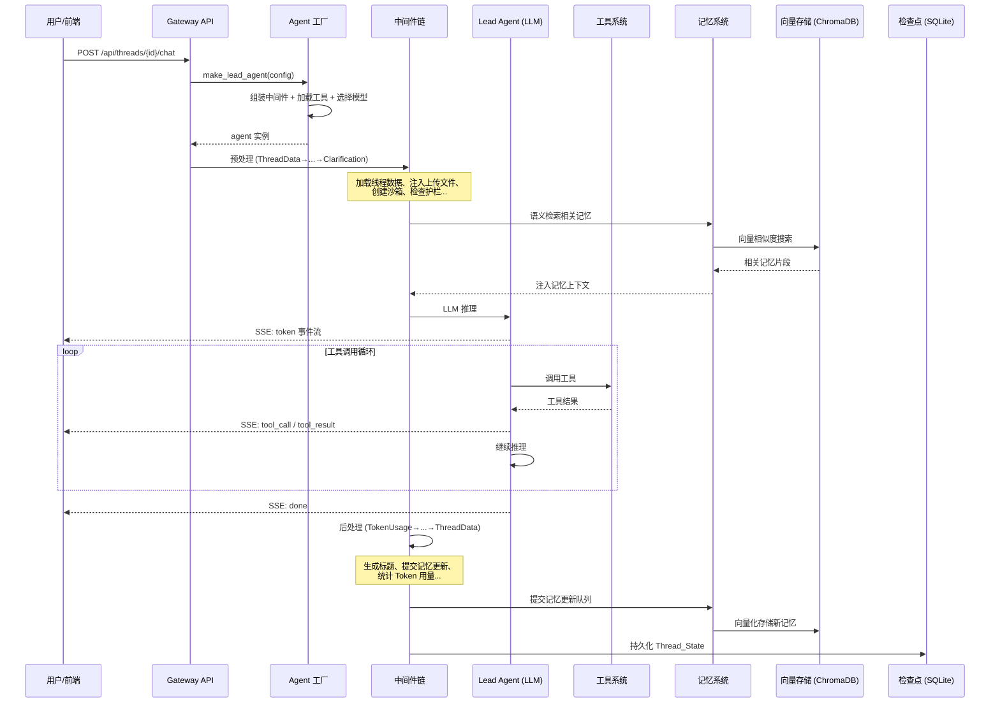

# 技术设计文档：hn-agent 后端系统

## 概述

hn-agent (Harness Agent) 是一个AI 超级 Agent 系统。系统采用 Harness（可发布框架包）+ App（应用层）双层架构，基于 LangGraph 构建核心推理引擎，提供沙箱代码执行、持久化记忆（含向量化长期记忆与语义检索）、子 Agent 委派、MCP 协议集成、多 IM 平台桥接等能力。

### 技术栈

- **语言**: Python 3.10
- **Agent 框架**: LangGraph v1.0+ / LangChain v1.0+
- **Web 框架**: FastAPI
- **嵌入模型**: text-embedding-3-small
- **向量数据库**: ChromaDB
- **检查点存储**: SQLite
- **配置格式**: YAML / JSON

### 设计目标

1. **双层隔离**: Harness 层可独立发布为 Python 包，App 层依赖 Harness 层但不可被反向导入
2. **可插拔架构**: 模型、沙箱、护栏、向量存储等核心组件均采用 Provider 模式，支持运行时替换
3. **流式优先**: 所有 Agent 推理通过 SSE 流式返回，支持 token 级别的实时推送
4. **中间件驱动**: 14 个有序中间件组成处理管道，横切关注点与核心推理解耦
5. **语义记忆**: 基于 Embedding + ChromaDB 的向量化长期记忆，支持跨会话语义检索

## 架构

### 系统架构图



### 双层架构说明

```
hn-agent/
├── hn_agent/                  # Harness 层 — 可独立发布的 Python 包
│   ├── agents/                # Agent 核心 (Lead Agent, 中间件, 记忆, 检查点, 工厂)
│   ├── sandbox/               # 沙箱系统 (Local/Docker Provider)
│   ├── tools/                 # 工具系统 (加载器 + 内置工具)
│   ├── subagents/             # 子 Agent 系统 (执行器 + 注册表 + 内置子 Agent)
│   ├── models/                # 模型工厂 (统一创建 + Provider 适配器)
│   ├── mcp/                   # MCP 集成 (客户端 + 缓存 + OAuth)
│   ├── skills/                # 技能系统 (加载 + 解析 + 安装)
│   ├── config/                # 配置系统 (多模块配置模型)
│   ├── guardrails/            # 护栏系统 (Provider 协议 + 内置实现)
│   ├── community/             # 社区工具 (Tavily/Jina/Firecrawl/DuckDuckGo)
│   ├── memory/                # 记忆系统 (更新器/队列/存储/提示词/向量化)
│   ├── uploads/               # 上传管理
│   ├── reflection/            # 反射系统
│   ├── client.py              # 嵌入式客户端
│   └── __init__.py            # 公开接口导出
│
├── app/                       # App 层 — 应用层，依赖 Harness 层
│   ├── gateway/               # Gateway API (FastAPI + 10 个路由模块)
│   └── channels/              # IM 渠道桥接 (飞书/Slack/Telegram)
│
├── tests/                     # 测试套件
├── pyproject.toml             # 项目配置与依赖
└── README.md
```

**依赖规则**:
- `app/` → `hn_agent/` ✅ (App 层可导入 Harness 层)
- `hn_agent/` → `app/` ❌ (Harness 层禁止导入 App 层)
- Harness 层通过 `hn_agent/__init__.py` 导出公开接口：`agents`, `sandbox`, `tools`, `models`, `mcp`, `skills`, `config`, `guardrails`, `memory`, `subagents`, `reflection`, `client`

### 核心数据流



## 组件与接口

### 1. 配置系统 (Config System)

**模块**: `hn_agent/config/`

**职责**: 统一的 YAML/JSON 配置加载、环境变量覆盖、类型化配置模型。

**核心接口**:

```python
# hn_agent/config/loader.py
class ConfigLoader:
    def load(self, config_path: str) -> AppConfig:
        """从指定路径加载配置文件，支持 YAML/JSON 格式"""
        ...

    def _apply_env_overrides(self, config: dict) -> dict:
        """环境变量覆盖同名配置项"""
        ...

# hn_agent/config/models.py
@dataclass
class AppConfig:
    app: AppSettings
    model: ModelSettings
    sandbox: SandboxSettings
    tool: ToolSettings
    memory: MemorySettings
    extensions: ExtensionsSettings
    guardrails: GuardrailSettings
    version: str

class ConfigurationError(Exception):
    """必需配置项缺失时抛出"""
    def __init__(self, missing_fields: list[str]): ...
```

**设计决策**: 使用 Pydantic BaseModel 作为配置模型基类，利用其内置的类型验证和 JSON Schema 生成能力。环境变量通过 `HN_AGENT_` 前缀命名空间隔离。

### 2. 反射系统 (Reflection System)

**模块**: `hn_agent/reflection/`

**职责**: 通过字符串路径动态加载模块、解析类和变量，支持可插拔组件架构。

**核心接口**:

```python
# hn_agent/reflection/resolvers.py
def resolve_module(module_path: str) -> ModuleType:
    """动态导入模块，失败抛出 ModuleNotFoundError"""
    ...

def resolve_class(class_path: str) -> type:
    """解析 'module.path:ClassName' 格式的类路径，返回类对象"""
    ...

def resolve_variable(var_path: str) -> Any:
    """解析变量路径，返回变量值"""
    ...
```

### 3. 模型工厂 (Model Factory)

**模块**: `hn_agent/models/`

**职责**: 多 LLM 提供商的统一创建入口，支持 thinking/vision 能力配置。

**核心接口**:

```python
# hn_agent/models/factory.py
def create_model(
    model_name: str,
    *,
    thinking: bool = False,
    vision: bool = False,
    **kwargs
) -> BaseChatModel:
    """统一模型创建入口，根据模型名称路由到对应 Provider"""
    ...

# hn_agent/models/base_provider.py
class ModelProvider(Protocol):
    def create(self, model_name: str, config: ModelSettings, **kwargs) -> BaseChatModel: ...

# 具体 Provider: OpenAIProvider, AnthropicProvider, DeepSeekProvider,
#                GoogleProvider, MiniMaxProvider, QwenProvider

class UnsupportedProviderError(Exception): ...
class CredentialError(Exception): ...
```

**设计决策**: 模型名称通过前缀路由（如 `gpt-` → OpenAI, `claude-` → Anthropic），每个 Provider 封装提供商特有的参数处理逻辑。

### 4. Lead Agent 核心

**模块**: `hn_agent/agents/lead_agent/`

**职责**: 基于 LangGraph 的主 Agent 引擎，处理用户消息、协调工具调用和推理。

**核心接口**:

```python
# hn_agent/agents/lead_agent/agent.py
def create_lead_agent(
    model: BaseChatModel,
    tools: list[BaseTool],
    system_prompt: str,
    checkpointer: BaseCheckpointSaver,
) -> CompiledGraph:
    """基于 LangGraph create_react_agent 构建 Agent 图"""
    ...

# hn_agent/agents/lead_agent/prompt.py
def build_system_prompt(
    agent_config: AgentConfig,
    skills: list[Skill],
    memory_context: str,
) -> str:
    """根据配置、技能和记忆上下文生成系统提示词"""
    ...
```

**设计决策**: 使用 LangGraph 的 `create_react_agent` 作为基础，通过中间件链在图执行前后注入横切逻辑。Agent 图本身保持简洁，复杂逻辑由中间件承担。

### 5. 中间件链 (Middleware Chain)

**模块**: `hn_agent/agents/middlewares/`

**职责**: 14 个有序中间件组成的处理管道，在 Agent 推理前后执行预处理和后处理。

**核心接口**:

```python
# hn_agent/agents/middlewares/base.py
class Middleware(Protocol):
    async def pre_process(self, state: ThreadState, config: AgentConfig) -> ThreadState:
        """预处理：Agent 推理前执行"""
        ...

    async def post_process(self, state: ThreadState, config: AgentConfig) -> ThreadState:
        """后处理：Agent 推理后执行（逆序执行）"""
        ...

# hn_agent/agents/middlewares/chain.py
class MiddlewareChain:
    middlewares: list[Middleware]  # 固定顺序的 14 个中间件

    async def run_pre(self, state: ThreadState, config: AgentConfig) -> ThreadState: ...
    async def run_post(self, state: ThreadState, config: AgentConfig) -> ThreadState: ...
```

**中间件执行顺序**:

| 序号 | 中间件 | 预处理职责 | 后处理职责 |
|------|--------|-----------|-----------|
| 1 | ThreadData | 加载线程关联数据 | — |
| 2 | Uploads | 注入上传文件内容 | — |
| 3 | Sandbox | 创建沙箱实例 | 清理沙箱资源 |
| 4 | DanglingToolCall | 检测未完成工具调用 | — |
| 5 | Guardrail | 工具调用授权检查 | — |
| 6 | Summarization | 历史消息摘要压缩 | — |
| 7 | TodoList | 维护任务列表状态 | — |
| 8 | Title | — | 自动生成对话标题 |
| 9 | Memory | 注入记忆上下文 | 提交记忆更新队列 |
| 10 | ViewImage | — | 处理生成的图片 |
| 11 | SubagentLimit | 限制子 Agent 并发 | — |
| 12 | Clarification | 检测澄清需求 | — |
| 13 | LoopDetection | 检测推理循环 | — |
| 14 | TokenUsage | — | 统计 Token 用量 |

### 6. 线程状态 (Thread State)

**模块**: `hn_agent/agents/thread_state.py`

**职责**: Agent 运行时的状态 Schema，包含自定义 reducer 保证状态合并一致性。

**核心接口**:

```python
# hn_agent/agents/thread_state.py
from langgraph.graph import MessagesState

class ThreadState(MessagesState):
    messages: Annotated[list[BaseMessage], add_messages]
    artifacts: Annotated[list[Artifact], artifacts_reducer]
    images: Annotated[list[ImageData], operator.add]
    title: str | None
    thread_data: dict[str, Any]

def artifacts_reducer(existing: list[Artifact], new: list[Artifact]) -> list[Artifact]:
    """自定义 reducer：支持 artifact 的增量追加和按 ID 更新"""
    ...
```

### 7. 沙箱系统 (Sandbox System)

**模块**: `hn_agent/sandbox/`

**职责**: 提供隔离的代码执行环境，支持 Local 和 Docker 两种 Provider。

**核心接口**:

```python
# hn_agent/sandbox/provider.py
class SandboxProvider(Protocol):
    async def execute(self, code: str, language: str, timeout: int) -> ExecutionResult: ...
    async def read_file(self, virtual_path: str) -> str: ...
    async def write_file(self, virtual_path: str, content: str) -> None: ...
    async def list_files(self, virtual_path: str) -> list[FileInfo]: ...

# hn_agent/sandbox/local/provider.py
class LocalProvider(SandboxProvider):
    """本地文件系统隔离目录中执行代码"""
    ...

# hn_agent/sandbox/docker/provider.py
class DockerAioProvider(SandboxProvider):
    """Docker 容器中执行代码"""
    ...

# hn_agent/sandbox/path_translator.py
def translate_path(virtual_path: str, sandbox_root: str) -> str:
    """虚拟路径翻译为沙箱内实际路径，防止路径逃逸"""
    ...
```

**沙箱工具**: `bash`（命令执行）、`ls`（目录列表）、`read`（文件读取）、`write`（文件写入）、`str_replace`（文本替换）

### 8. 工具系统 (Tool System)

**模块**: `hn_agent/tools/`

**职责**: 统一的工具注册与加载机制，支持四类工具。

**核心接口**:

```python
# hn_agent/tools/loader.py
class ToolLoader:
    def load_tools(self, agent_config: AgentConfig) -> list[BaseTool]:
        """根据 Agent 配置动态加载所需的工具集"""
        ...

    def _load_sandbox_tools(self, sandbox: SandboxProvider) -> list[BaseTool]: ...
    def _load_builtin_tools(self, features: Features) -> list[BaseTool]: ...
    def _load_mcp_tools(self, mcp_servers: list[str]) -> list[BaseTool]: ...
    def _load_community_tools(self, tool_names: list[str]) -> list[BaseTool]: ...
```

**内置工具**: `clarification`、`present_file`、`view_image`、`task`（子 Agent 委派）、`invoke_acp_agent`、`setup_agent`、`tool_search`

### 9. 子 Agent 系统 (Subagent System)

**模块**: `hn_agent/subagents/`

**职责**: 异步任务委派和双线程池并发执行。

**核心接口**:

```python
# hn_agent/subagents/registry.py
class SubagentRegistry:
    def register(self, name: str, agent_def: SubagentDefinition) -> None: ...
    def get(self, name: str) -> SubagentDefinition | None: ...

# hn_agent/subagents/executor.py
class SubagentExecutor:
    _io_pool: ThreadPoolExecutor      # I/O 密集型任务
    _cpu_pool: ThreadPoolExecutor     # CPU 密集型任务

    async def submit(self, task: SubagentTask) -> str:
        """异步提交子 Agent 任务，返回任务 ID"""
        ...

    async def get_result(self, task_id: str) -> SubagentResult: ...
```

**内置子 Agent**: `general_purpose`（通用 Agent）、`bash_agent`（Bash 专家）

### 10. 记忆系统 (Memory System)

**模块**: `hn_agent/memory/`

**职责**: LLM 驱动的持久化上下文记忆，含防抖队列、原子文件 I/O、向量化长期记忆和语义检索。

**核心接口**:

```python
# hn_agent/memory/updater.py
class MemoryUpdater:
    async def extract_and_update(self, messages: list[BaseMessage], existing_memory: str) -> str:
        """使用 LLM 从对话中提取关键信息并更新记忆"""
        ...

# hn_agent/memory/queue.py
class DebounceQueue:
    def submit(self, thread_id: str, messages: list[BaseMessage]) -> None:
        """提交记忆更新请求，短时间内多次请求合并为一次 LLM 调用"""
        ...

# hn_agent/memory/storage.py
class MemoryStorage:
    def read(self, user_id: str) -> str:
        """原子读取记忆文件"""
        ...
    def write(self, user_id: str, content: str) -> None:
        """原子写入记忆文件（写入临时文件后原子重命名）"""
        ...

# hn_agent/memory/vector_store.py
class VectorStoreProvider(Protocol):
    async def add_memories(self, memories: list[MemoryChunk]) -> None: ...
    async def search(self, query: str, top_k: int = 5) -> list[MemoryChunk]: ...

class ChromaVectorStore(VectorStoreProvider):
    """基于 ChromaDB 的向量存储实现"""
    def __init__(self, collection_name: str, embedding_model: Embeddings): ...

# hn_agent/memory/embedding.py
class EmbeddingClient:
    """text-embedding-3-small 嵌入模型客户端"""
    def embed_texts(self, texts: list[str]) -> list[list[float]]: ...
    def embed_query(self, query: str) -> list[float]: ...

# hn_agent/memory/prompt.py
def build_memory_prompt(short_term: str, long_term_results: list[MemoryChunk]) -> str:
    """将短期记忆和长期语义检索结果注入系统提示词"""
    ...
```

**设计决策**:
- 短期记忆使用原子文件 I/O 存储（写入临时文件后 `os.rename` 原子重命名）
- 长期记忆使用 ChromaDB 向量化存储，通过 text-embedding-3-small 生成向量
- 防抖队列合并高频更新请求，减少 LLM 调用次数
- VectorStoreProvider 为可插拔接口，支持替换为其他向量数据库

### 11. MCP 集成 (MCP Client)

**模块**: `hn_agent/mcp/`

**职责**: 多服务器 MCP 客户端，懒加载缓存，OAuth 支持。

**核心接口**:

```python
# hn_agent/mcp/client.py
class MCPClient:
    async def connect(self, server_config: MCPServerConfig) -> None: ...
    async def list_tools(self, server_name: str) -> list[BaseTool]: ...
    async def call_tool(self, server_name: str, tool_name: str, args: dict) -> Any: ...

# hn_agent/mcp/cache.py
class MCPToolCache:
    """懒加载缓存：首次请求时连接服务器并缓存工具列表"""
    async def get_tools(self, server_name: str) -> list[BaseTool]: ...

# hn_agent/mcp/oauth.py
class MCPOAuthHandler:
    """OAuth 认证流程处理"""
    async def authenticate(self, server_config: MCPServerConfig) -> str: ...
```

**支持的传输协议**: stdio、SSE、HTTP

### 12. 技能系统 (Skill System)

**模块**: `hn_agent/skills/`

**核心接口**:

```python
# hn_agent/skills/loader.py
class SkillLoader:
    def discover(self, skills_dir: str) -> list[Skill]: ...
    def load(self, skill_name: str) -> Skill: ...

# hn_agent/skills/parser.py
class SkillParser:
    def parse(self, content: str) -> Skill:
        """解析 SKILL.md 文件的 YAML frontmatter 和 Markdown 内容"""
        ...

# hn_agent/skills/installer.py
class SkillInstaller:
    def install(self, package_url: str, target_dir: str) -> Skill: ...

# hn_agent/skills/types.py
@dataclass
class Skill:
    name: str
    description: str
    dependencies: list[str]  # 依赖的工具名称
    prompt: str              # 技能提示词内容
```

### 13. 护栏系统 (Guardrail System)

**模块**: `hn_agent/guardrails/`

**核心接口**:

```python
# hn_agent/guardrails/provider.py
class GuardrailProvider(Protocol):
    async def check_authorization(
        self, tool_name: str, args: dict, context: GuardrailContext
    ) -> AuthorizationResult: ...

@dataclass
class AuthorizationResult:
    authorized: bool
    reason: str | None = None

# hn_agent/guardrails/builtin.py
class RuleBasedGuardrailProvider(GuardrailProvider):
    """基于配置规则的授权检查实现"""
    def __init__(self, rules: list[GuardrailRule]): ...
```

### 14. 上传管理 (Upload Manager)

**模块**: `hn_agent/uploads/`

**核心接口**:

```python
# hn_agent/uploads/manager.py
class UploadManager:
    def save(self, thread_id: str, file: UploadFile) -> FileMetadata: ...
    def convert_to_markdown(self, file_path: str) -> str:
        """PDF/PPT/Excel/Word → Markdown 转换"""
        ...
    def get_metadata(self, file_id: str) -> FileMetadata: ...

@dataclass
class FileMetadata:
    file_id: str
    filename: str
    size: int
    mime_type: str
    upload_time: datetime
    markdown_path: str | None  # 转换后的 Markdown 路径
```

### 15. 检查点系统 (Checkpoint System)

**模块**: `hn_agent/agents/checkpointer/`

**核心接口**:

```python
# hn_agent/agents/checkpointer/provider.py
class SQLiteCheckpointer(BaseCheckpointSaver):
    """同步 SQLite 检查点 Provider"""
    def put(self, config: RunnableConfig, checkpoint: Checkpoint) -> None: ...
    def get(self, config: RunnableConfig) -> Checkpoint | None: ...

# hn_agent/agents/checkpointer/async_provider.py
class AsyncSQLiteCheckpointer(BaseCheckpointSaver):
    """异步 SQLite 检查点 Provider"""
    async def aput(self, config: RunnableConfig, checkpoint: Checkpoint) -> None: ...
    async def aget(self, config: RunnableConfig) -> Checkpoint | None: ...
```

### 16. 嵌入式客户端 (Embedded Client)

**模块**: `hn_agent/client.py`

**核心接口**:

```python
# hn_agent/client.py
class HarnessClient:
    def __init__(self, config_path: str | None = None): ...

    async def chat(self, thread_id: str, message: str, **kwargs) -> ChatResponse: ...
    async def stream(self, thread_id: str, message: str, **kwargs) -> AsyncGenerator[SSEEvent]: ...
    async def get_thread(self, thread_id: str) -> ThreadInfo: ...
    async def list_threads(self) -> list[ThreadInfo]: ...
```

### 17. Gateway API

**模块**: `app/gateway/`

**职责**: FastAPI REST 服务，10 个路由模块。

**路由模块**:

| 路由模块 | 路径前缀 | 核心端点 |
|---------|---------|---------|
| models | `/api/models` | GET 可用模型列表 |
| mcp | `/api/mcp` | GET MCP 服务器及工具信息 |
| skills | `/api/skills` | GET 已加载技能列表 |
| memory | `/api/memory` | GET/PUT 记忆内容 |
| uploads | `/api/threads/{id}/uploads` | POST 文件上传 |
| threads | `/api/threads` | GET/POST 线程管理, POST chat (SSE) |
| artifacts | `/api/threads/{id}/artifacts` | GET artifacts 列表 |
| suggestions | `/api/threads/{id}/suggestions` | GET 建议回复 |
| agents | `/api/agents` | GET/POST Agent 配置管理 |
| channels | `/api/channels` | GET/POST 渠道管理 |

### 18. IM 渠道桥接 (Channel Bridge)

**模块**: `app/channels/`

**核心接口**:

```python
# app/channels/base.py
class Channel(ABC):
    @abstractmethod
    async def receive_message(self, raw_payload: dict) -> ChannelMessage: ...
    @abstractmethod
    async def send_message(self, channel_id: str, content: str) -> None: ...
    @abstractmethod
    async def setup_webhook(self, webhook_url: str) -> None: ...

# app/channels/manager.py
class ChannelManager:
    async def handle_message(self, channel_type: str, payload: dict) -> None: ...

# app/channels/message_bus.py
class MessageBus:
    async def publish(self, message: ChannelMessage) -> None: ...
    async def subscribe(self, handler: Callable) -> None: ...

# app/channels/store.py
class ChannelStore:
    def get_thread_id(self, channel_type: str, channel_session_id: str) -> str | None: ...
    def set_thread_id(self, channel_type: str, channel_session_id: str, thread_id: str) -> None: ...
```

**实现**: `FeishuChannel`、`SlackChannel`、`TelegramChannel`

### 19. 社区工具 (Community Tools)

**模块**: `hn_agent/community/`

**职责**: 外部搜索和内容获取工具的 LangChain Tool 封装。

**集成工具**: Tavily（搜索）、Jina（内容提取）、Firecrawl（网页抓取）、DuckDuckGo（搜索）

每个工具提供统一的 `BaseTool` 接口，从 Config_System 加载 API 密钥。

### 20. Agent 工厂 (Agent Factory)

**模块**: `hn_agent/agents/factory.py` + `hn_agent/agents/features.py`

**核心接口**:

```python
# hn_agent/agents/factory.py
async def make_lead_agent(agent_config: AgentConfig) -> CompiledGraph:
    """根据配置创建完整的 Lead Agent 实例：
    1. 选择模型 (Model Factory)
    2. 加载工具 (Tool Loader)
    3. 组装中间件链 (Middleware Chain)
    4. 生成系统提示词 (Prompt Builder)
    5. 创建 LangGraph Agent
    """
    ...

# hn_agent/agents/features.py
@dataclass
class Features:
    sandbox_enabled: bool = True
    memory_enabled: bool = True
    subagent_enabled: bool = True
    guardrail_enabled: bool = True
    mcp_enabled: bool = True

    @classmethod
    def from_config(cls, config: dict) -> "Features": ...
```

### 21. SSE 流式响应

**事件类型**:

```python
@dataclass
class SSEEvent:
    event: str   # token | tool_call | tool_result | subagent_start | subagent_result | done
    data: dict

# 事件流生成
async def stream_agent_response(agent: CompiledGraph, input: dict) -> AsyncGenerator[SSEEvent]:
    """将 LangGraph 的流式输出转换为 SSE 事件流"""
    ...
```

## 数据模型

### 核心数据模型

```mermaid
classDiagram
    class ThreadState {
        +list~BaseMessage~ messages
        +list~Artifact~ artifacts
        +list~ImageData~ images
        +str|None title
        +dict thread_data
        +to_json() dict
    }

    class Artifact {
        +str id
        +str type
        +str title
        +str content
        +datetime created_at
    }

    class ImageData {
        +str id
        +str url
        +str alt_text
        +bytes|None data
    }

    class AgentConfig {
        +str agent_id
        +str name
        +str model_name
        +Features features
        +list~str~ skill_names
        +list~str~ mcp_servers
        +list~str~ community_tools
        +dict custom_settings
    }

    class Features {
        +bool sandbox_enabled
        +bool memory_enabled
        +bool subagent_enabled
        +bool guardrail_enabled
        +bool mcp_enabled
        +from_config(dict) Features
    }

    class Skill {
        +str name
        +str description
        +list~str~ dependencies
        +str prompt
    }

    class FileMetadata {
        +str file_id
        +str filename
        +int size
        +str mime_type
        +datetime upload_time
        +str|None markdown_path
    }

    class MemoryChunk {
        +str id
        +str content
        +str user_id
        +str thread_id
        +list~float~ embedding
        +datetime created_at
        +dict metadata
    }

    class ExecutionResult {
        +bool success
        +str stdout
        +str stderr
        +int exit_code
        +float duration
    }

    class SubagentTask {
        +str task_id
        +str agent_name
        +str instruction
        +str parent_thread_id
        +dict context
    }

    class SubagentResult {
        +str task_id
        +bool success
        +str output
        +str|None error
    }

    class SSEEvent {
        +str event
        +dict data
    }

    class ChannelMessage {
        +str channel_type
        +str channel_session_id
        +str sender_id
        +str content
        +list~Attachment~ attachments
        +datetime timestamp
    }

    class GuardrailRule {
        +str tool_pattern
        +str action
        +dict conditions
    }

    class AuthorizationResult {
        +bool authorized
        +str|None reason
    }

    ThreadState --> Artifact
    ThreadState --> ImageData
    AgentConfig --> Features
    SubagentTask --> SubagentResult
    GuardrailRule --> AuthorizationResult
```



### 配置数据模型

```python
# 所有配置模型基于 Pydantic BaseModel

class AppConfig(BaseModel):
    app: AppSettings
    model: ModelSettings
    sandbox: SandboxSettings
    tool: ToolSettings
    memory: MemorySettings
    extensions: ExtensionsSettings
    guardrails: GuardrailSettings
    version: str = "1.0"

class ModelSettings(BaseModel):
    default_model: str
    providers: dict[str, ProviderConfig]  # provider_name → config

class ProviderConfig(BaseModel):
    api_key: str | None = None
    api_base: str | None = None
    extra: dict[str, Any] = {}

class MemorySettings(BaseModel):
    enabled: bool = True
    debounce_seconds: float = 5.0
    storage_dir: str = "./data/memory"
    vector_store: VectorStoreSettings = VectorStoreSettings()

class VectorStoreSettings(BaseModel):
    provider: str = "chromadb"
    collection_name: str = "hn_agent_memories"
    embedding_model: str = "text-embedding-3-small"
    persist_directory: str = "./data/chromadb"
    top_k: int = 5

class SandboxSettings(BaseModel):
    provider: str = "local"  # local | docker
    timeout: int = 30
    work_dir: str = "./data/sandbox"

class MCPServerConfig(BaseModel):
    name: str
    transport: str  # stdio | sse | http
    command: str | None = None
    url: str | None = None
    oauth: OAuthConfig | None = None
```

### 持久化存储

| 存储类型 | 技术 | 用途 | 位置 |
|---------|------|------|------|
| 检查点 | SQLite | Agent 状态持久化 | `./data/checkpoints.db` |
| 短期记忆 | 原子文件 I/O | 用户级记忆文本 | `./data/memory/{user_id}.md` |
| 长期记忆 | ChromaDB | 向量化记忆存储与语义检索 | `./data/chromadb/` |
| 上传文件 | 文件系统 | 用户上传的文档 | `./data/uploads/{thread_id}/` |
| 渠道映射 | JSON 文件 | IM 会话 → Agent 线程映射 | `./data/channels/store.json` |
| 配置 | YAML/JSON | 应用配置 | `./config/` |

## 正确性属性 (Correctness Properties)

*属性（Property）是在系统所有合法执行中都应成立的特征或行为——本质上是对系统应做什么的形式化陈述。属性是人类可读规格说明与机器可验证正确性保证之间的桥梁。*

### Property 1: 配置加载往返一致性

*For any* 合法的 AppConfig 对象，将其序列化为 YAML/JSON 文件后再通过 ConfigLoader 加载，应产生与原始对象等价的配置。

**Validates: Requirements 1.1**

### Property 2: 环境变量覆盖优先级

*For any* 配置字典和同名环境变量集合，加载后的配置值应等于环境变量的值，而非配置文件中的值。

**Validates: Requirements 1.2**

### Property 3: 未知配置项被忽略

*For any* 包含未知键的配置字典，加载后的配置对象不应包含这些未知键，且加载过程不应抛出异常。

**Validates: Requirements 1.4**

### Property 4: 必需配置项缺失抛出异常

*For any* 缺少至少一个必需字段的配置字典，ConfigLoader 应抛出 ConfigurationError，且异常信息中包含缺失字段的名称。

**Validates: Requirements 1.5**

### Property 5: 反射系统路径解析正确性

*For any* 合法的 "module.path:Name" 格式路径字符串，resolve_class 应返回对应的类对象，resolve_variable 应返回对应的变量值，且返回对象的名称与路径中指定的名称一致。

**Validates: Requirements 2.2, 2.3**

### Property 6: 反射系统无效路径错误处理

*For any* 不存在的模块路径，resolve_module 应抛出 ModuleNotFoundError；*for any* 合法模块中不存在的属性名，resolve_class/resolve_variable 应抛出 AttributeError，且异常信息包含路径信息。

**Validates: Requirements 2.4, 2.5**

### Property 7: 模型工厂对所有支持的提供商返回 BaseChatModel

*For any* 受支持的提供商名称和合法配置，create_model 应返回 BaseChatModel 的实例。

**Validates: Requirements 3.1**

### Property 8: 不支持的提供商抛出 UnsupportedProviderError

*For any* 不匹配任何已知提供商前缀的模型名称，create_model 应抛出 UnsupportedProviderError，且异常信息包含该提供商名称。

**Validates: Requirements 3.6**

### Property 9: API 凭证缺失抛出 CredentialError

*For any* 受支持的提供商，当其 API 凭证为空或缺失时，create_model 应抛出 CredentialError，且异常信息包含提供商名称。

**Validates: Requirements 3.7**

### Property 10: 系统提示词包含所有技能内容

*For any* Agent 配置和技能列表，build_system_prompt 生成的提示词应包含每个技能的 prompt 内容。

**Validates: Requirements 4.5, 12.5**

### Property 11: 中间件执行顺序不变性

*For any* 中间件链执行，预处理应按正向顺序（ThreadData → ... → Clarification）执行，后处理应按逆序（TokenUsage → ... → ThreadData）执行。

**Validates: Requirements 5.2, 5.3**

### Property 12: 沙箱中间件生命周期往返

*For any* Agent 处理流程，Sandbox 中间件在预处理阶段创建的沙箱实例应在后处理阶段被清理，清理后沙箱资源不可访问。

**Validates: Requirements 5.6, 7.8**

### Property 13: 悬挂工具调用检测

*For any* 包含未完成工具调用的 ThreadState，DanglingToolCall 中间件应检测到这些调用并将状态修正为一致。

**Validates: Requirements 5.7**

### Property 14: 摘要压缩阈值触发

*For any* 消息列表，当消息数量超过配置的长度阈值时，Summarization 中间件应减少消息数量；当未超过阈值时，消息列表应保持不变。

**Validates: Requirements 5.9**

### Property 15: 子 Agent 并发限制

*For any* 并发子 Agent 请求数量，SubagentLimit 中间件应确保同时运行的子 Agent 数量不超过配置的上限。

**Validates: Requirements 5.14**

### Property 16: 循环检测终止

*For any* Agent 动作序列，当相同的动作模式重复超过配置的阈值次数时，LoopDetection 中间件应终止推理。

**Validates: Requirements 5.16**

### Property 17: Token 用量统计准确性

*For any* 包含已知 token 数量的消息集合，TokenUsage 中间件统计的总量应等于各消息 token 数之和。

**Validates: Requirements 5.17**

### Property 18: ThreadState Reducer 一致性

*For any* 现有 artifact/image 列表和新增列表，reducer 应正确执行增量追加（新 ID）和按 ID 更新（已有 ID），且多次并发修改的合并结果应是确定性的。

**Validates: Requirements 6.2, 6.3, 6.4**

### Property 19: ThreadState JSON 序列化往返

*For any* 合法的 ThreadState 对象，序列化为 JSON 后再反序列化应产生与原始对象等价的状态。

**Validates: Requirements 6.5**

### Property 20: 虚拟路径翻译防逃逸

*For any* 虚拟路径字符串（包括含 `../`、绝对路径、符号链接等恶意路径），translate_path 的结果应始终位于沙箱根目录内。

**Validates: Requirements 7.4**

### Property 21: 沙箱执行超时终止

*For any* 超过配置超时时间的代码执行，沙箱应终止执行并返回包含超时错误的 ExecutionResult。

**Validates: Requirements 7.6**

### Property 22: 沙箱异常捕获结构化返回

*For any* 执行过程中抛出异常的代码，沙箱应返回 success=False 的 ExecutionResult，且 stderr 包含错误详情。

**Validates: Requirements 7.7**

### Property 23: 工具加载器按配置加载

*For any* Agent 配置中指定的工具集，ToolLoader 返回的工具列表应恰好包含配置中指定的所有工具。

**Validates: Requirements 8.2**

### Property 24: 所有工具具备完整元数据

*For any* 已注册的工具，应具有非空的 name、description 和合法的参数 Schema。

**Validates: Requirements 8.6**

### Property 25: 子 Agent 注册表往返

*For any* SubagentDefinition 以名称注册后，通过相同名称查找应返回与注册时等价的定义。

**Validates: Requirements 9.1**

### Property 26: 子 Agent 错误捕获

*For any* 执行失败的子 Agent 任务，SubagentExecutor 应返回包含错误信息的 SubagentResult，而非抛出未捕获异常。

**Validates: Requirements 9.6**

### Property 27: 防抖队列合并请求

*For any* 在防抖窗口内提交的 N 次记忆更新请求（N > 1），DebounceQueue 应将其合并为一次 LLM 调用。

**Validates: Requirements 10.2**

### Property 28: 记忆存储原子往返

*For any* 记忆内容字符串，通过 MemoryStorage.write 写入后再通过 MemoryStorage.read 读取，应返回与写入内容相同的字符串。

**Validates: Requirements 10.3**

### Property 29: 记忆提示词包含记忆内容

*For any* 短期记忆文本和长期记忆检索结果，build_memory_prompt 生成的提示词应包含这些记忆内容。

**Validates: Requirements 10.4**

### Property 30: 向量化记忆存储与检索往返

*For any* 存储到 VectorStore 的 MemoryChunk，使用该 chunk 的内容作为查询进行语义搜索，返回的结果中应包含该 chunk。

**Validates: Requirements 10.8, 10.10, 10.11**

### Property 31: Embedding 向量维度一致性

*For any* 文本输入，EmbeddingClient.embed_texts 产生的向量维度应一致，且与 embed_query 产生的向量维度相同。

**Validates: Requirements 10.9**

### Property 32: MCP 工具缓存懒加载

*For any* MCP 服务器，首次请求应触发连接并缓存工具列表，后续请求应直接返回缓存结果而不重新连接。

**Validates: Requirements 11.2**

### Property 33: MCP 工具转换为 LangChain Tool

*For any* MCP 服务器返回的工具定义，转换后的 BaseTool 应具有正确的 name、description 和参数 Schema。

**Validates: Requirements 11.4**

### Property 34: 技能文件发现完整性

*For any* 包含 N 个 SKILL.md 文件的目录，SkillLoader.discover 应返回恰好 N 个 Skill 对象。

**Validates: Requirements 12.1**

### Property 35: SKILL.md YAML frontmatter 解析

*For any* 包含合法 YAML frontmatter 的 SKILL.md 内容，SkillParser.parse 应正确提取 name、description、dependencies 字段。

**Validates: Requirements 12.2**

### Property 36: 技能文件验证

*For any* 缺少必需字段的 SKILL.md 内容，验证应失败并返回包含具体错误位置的信息。

**Validates: Requirements 12.3, 12.6**

### Property 37: 护栏规则授权检查

*For any* 工具调用和授权规则集，RuleBasedGuardrailProvider 的授权结果应与规则评估一致：匹配拒绝规则时 authorized=False 且包含拒绝原因，否则 authorized=True。

**Validates: Requirements 13.2, 13.4**

### Property 38: 上传文件元数据完整性

*For any* 上传的文件，UploadManager 应生成唯一的 file_id，且 FileMetadata 包含正确的 filename、size、mime_type 和 upload_time，文件应存储在对应线程目录中。

**Validates: Requirements 14.1, 14.4**

### Property 39: 检查点存储往返

*For any* 合法的 ThreadState，通过 SQLiteCheckpointer.put 存储后再通过 get 加载，应产生与原始状态等价的 ThreadState。

**Validates: Requirements 15.3, 15.4**

### Property 40: 嵌入式客户端接口对齐

*For any* Gateway API 暴露的核心方法（chat、stream、get_thread、list_threads），HarnessClient 应提供同名方法且参数签名兼容。

**Validates: Requirements 16.2**

### Property 41: API 输入验证

*For any* 不合法的请求载荷（缺少必需字段、类型错误等），Gateway API 应返回 4xx 状态码且响应体包含错误详情。

**Validates: Requirements 17.12**

### Property 42: MessageBus 消息投递

*For any* 发布到 MessageBus 的消息，所有已注册的订阅者应收到该消息。

**Validates: Requirements 18.4**

### Property 43: 渠道会话映射往返

*For any* channel_type 和 channel_session_id 到 thread_id 的映射，通过 ChannelStore.set_thread_id 存储后再通过 get_thread_id 查找，应返回相同的 thread_id。

**Validates: Requirements 18.5**

### Property 44: 社区工具接口一致性

*For any* 社区工具实例，应是合法的 BaseTool，具有非空的 name、description 和参数 Schema。

**Validates: Requirements 19.2**

### Property 45: 社区工具错误结构化返回

*For any* 外部 API 调用失败，社区工具应返回包含 error_type 和 error_message 的结构化结果，而非抛出未捕获异常。

**Validates: Requirements 19.4**

### Property 46: 特性配置控制加载

*For any* Features 配置，Agent 工厂应仅加载已启用特性对应的中间件和工具，禁用的特性不应产生对应的中间件或工具。

**Validates: Requirements 20.3, 20.4**

### Property 47: Harness 层不导入 App 层

*For any* Harness 层（hn_agent/）中的 Python 模块，其导入语句不应引用 App 层（app/）中的任何模块。

**Validates: Requirements 21.1, 21.3**

### Property 48: Harness 层公开接口完整性

*For any* 指定的公开模块名称（agents、sandbox、tools、models、mcp、skills、config、guardrails、memory、subagents、reflection、client），应可从 hn_agent 包成功导入。

**Validates: Requirements 21.4**

### Property 49: SSE 事件类型合法性

*For any* Agent 推理过程中产生的 SSE 事件，其 event 字段应为以下之一：token、tool_call、tool_result、subagent_start、subagent_result、done。

**Validates: Requirements 22.2**

## 错误处理

### 异常层次结构

```python
class HarnessError(Exception):
    """所有 hn-agent 异常的基类"""

class ConfigurationError(HarnessError):
    """配置相关错误：缺失必需项、格式错误"""
    missing_fields: list[str]

class UnsupportedProviderError(HarnessError):
    """不支持的模型提供商"""
    provider_name: str

class CredentialError(HarnessError):
    """API 凭证缺失或无效"""
    provider_name: str

class SandboxError(HarnessError):
    """沙箱执行错误基类"""

class SandboxTimeoutError(SandboxError):
    """沙箱执行超时"""

class PathEscapeError(SandboxError):
    """路径逃逸尝试"""

class SkillValidationError(HarnessError):
    """技能文件验证失败"""
    errors: list[dict]  # 包含具体错误位置

class AuthorizationDeniedError(HarnessError):
    """护栏授权拒绝"""
    tool_name: str
    reason: str

class MCPConnectionError(HarnessError):
    """MCP 服务器连接失败"""

class VectorStoreError(HarnessError):
    """向量存储连接失败或查询超时"""
```

### 错误处理策略

| 场景 | 策略 | 说明 |
|------|------|------|
| 配置加载失败 | 快速失败 | 抛出 ConfigurationError，阻止应用启动 |
| 模型创建失败 | 快速失败 | 抛出具体异常，阻止 Agent 创建 |
| 沙箱执行异常 | 捕获并结构化返回 | 返回 ExecutionResult(success=False) |
| 沙箱执行超时 | 终止并返回 | 强制终止进程，返回超时错误 |
| 路径逃逸尝试 | 拒绝并记录 | 抛出 PathEscapeError，记录安全日志 |
| 工具调用授权失败 | 阻止并通知 | 返回拒绝原因给 Agent |
| MCP 连接失败 | 重试后降级 | 按配置间隔重试，最终记录错误日志 |
| 记忆文件写入失败 | 保留旧数据 | 原子写入失败时旧文件不受影响 |
| 向量存储连接失败 | 降级运行 | 记录错误日志，Agent 继续运行但无长期记忆检索 |
| 检查点数据损坏 | 创建空白状态 | 记录错误日志，创建新的空白 ThreadState |
| 文件格式转换失败 | 保留原始文件 | 记录错误，返回转换失败原因 |
| 子 Agent 执行失败 | 捕获并返回 | 将错误信息返回给主 Agent |
| SSE 连接中断 | 清理资源 | 终止推理，清理 Agent 资源 |
| 外部 API 调用失败 | 结构化错误返回 | 返回包含 error_type 和 message 的结果 |
| API 请求验证失败 | 4xx 响应 | 返回包含错误详情的 HTTP 错误响应 |

## 测试策略

### 双重测试方法

本项目采用单元测试 + 属性测试的双重测试策略：

- **单元测试**: 验证具体示例、边界情况和错误条件
- **属性测试**: 验证跨所有输入的通用属性

两者互补：单元测试捕获具体 bug，属性测试验证通用正确性。

### 属性测试配置

- **测试库**: [Hypothesis](https://hypothesis.readthedocs.io/) (Python 属性测试标准库)
- **最小迭代次数**: 每个属性测试至少 100 次迭代
- **标签格式**: `# Feature: hn_agent_backend, Property {number}: {property_text}`
- **每个正确性属性由一个属性测试实现**

### 测试分层

| 层级 | 测试类型 | 覆盖范围 | 工具 |
|------|---------|---------|------|
| 单元测试 | 具体示例 + 边界情况 | 各组件独立功能 | pytest |
| 属性测试 | 通用属性验证 | 49 个正确性属性 | pytest + Hypothesis |
| 集成测试 | 组件间交互 | API 端点、中间件链、Agent 流程 | pytest + httpx |

### 单元测试重点

单元测试应聚焦于：
- 各 Provider 的具体行为示例（如特定模型名称的路由）
- 边界情况（空输入、超大输入、特殊字符）
- 错误条件（连接失败、超时、数据损坏）
- 集成点（中间件与 Agent 的交互、API 路由与服务的交互）

避免编写过多单元测试——属性测试已覆盖大量输入组合。

### 属性测试重点

每个正确性属性（Property 1-49）对应一个 Hypothesis 属性测试，重点覆盖：

- **往返属性**: 配置加载、ThreadState 序列化、检查点存储、记忆存储、向量存储、子 Agent 注册、渠道映射
- **不变量**: 中间件执行顺序、路径逃逸防护、工具元数据完整性、SSE 事件类型合法性
- **错误条件**: 无效路径、缺失配置、不支持的提供商、凭证缺失
- **幂等性/合并**: Reducer 一致性、防抖队列合并
- **元变换**: 特性配置控制加载、环境变量覆盖优先级

### 测试目录结构

```
tests/
├── unit/                      # 单元测试
│   ├── test_config.py
│   ├── test_reflection.py
│   ├── test_models.py
│   ├── test_thread_state.py
│   ├── test_sandbox.py
│   ├── test_tools.py
│   ├── test_subagents.py
│   ├── test_memory.py
│   ├── test_mcp.py
│   ├── test_skills.py
│   ├── test_guardrails.py
│   ├── test_uploads.py
│   └── test_sse.py
├── properties/                # 属性测试
│   ├── test_config_properties.py
│   ├── test_reflection_properties.py
│   ├── test_models_properties.py
│   ├── test_thread_state_properties.py
│   ├── test_sandbox_properties.py
│   ├── test_middleware_properties.py
│   ├── test_tools_properties.py
│   ├── test_subagents_properties.py
│   ├── test_memory_properties.py
│   ├── test_skills_properties.py
│   ├── test_guardrails_properties.py
│   ├── test_uploads_properties.py
│   ├── test_channels_properties.py
│   ├── test_architecture_properties.py
│   └── test_sse_properties.py
└── integration/               # 集成测试
    ├── test_gateway_api.py
    ├── test_agent_flow.py
    └── test_channel_bridge.py
```
