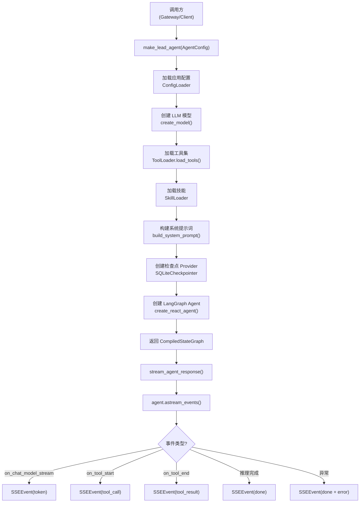

# Agent 引擎深度分析

## 1. 功能概述

Agent 引擎是 HN-Agent 的核心模块，负责基于 LangGraph ReAct 模式创建和运行主 Agent（Lead Agent）。它通过工厂模式（`make_lead_agent`）将模型选择、工具加载、技能注入、检查点持久化等步骤组装为一个完整的 `CompiledStateGraph` 实例，并通过 SSE 流式响应将 LangGraph 的流式输出转换为前端可消费的事件流。模块还包含线程状态 Schema（`ThreadState`）定义、特性开关管理（`Features`）和 SQLite 检查点持久化（同步/异步双 Provider）。

## 2. 核心流程图



## 3. 核心调用链

```
make_lead_agent(agent_config)                    # hn_agent/agents/factory.py
  → ConfigLoader().load_from_dict({})            # hn_agent/config/loader.py
  → create_model(model_name, config)             # hn_agent/models/factory.py
  → ToolLoader().load_tools(tool_config)         # hn_agent/tools/loader.py
  → _load_skills(skill_names)                    # hn_agent/agents/factory.py
      → SkillLoader().load(name)                 # hn_agent/skills/loader.py
  → build_system_prompt(agent_config, skills)    # hn_agent/agents/lead_agent/prompt.py
  → _create_checkpointer()                       # hn_agent/agents/factory.py
      → SQLiteCheckpointer()                     # hn_agent/agents/checkpointer/provider.py
  → create_lead_agent(model, tools, prompt, cp)  # hn_agent/agents/lead_agent/agent.py
      → create_react_agent(model, tools, ...)    # langgraph.prebuilt

stream_agent_response(agent, input, config)      # hn_agent/agents/streaming.py
  → agent.astream_events(input, config, v2)      # LangGraph 流式 API
  → _map_langgraph_event(event)                  # hn_agent/agents/streaming.py
  → yield SSEEvent(...)                          # 逐事件输出
```

## 4. 关键数据结构

```python
# Agent 创建配置
@dataclass
class AgentConfig:
    agent_id: str = "default"          # Agent 唯一标识
    name: str = "Lead Agent"           # 显示名称
    model_name: str = "gpt-4o"         # LLM 模型名称
    features: Features                  # 特性开关
    skill_names: list[str]             # 技能名称列表
    mcp_servers: list[str]             # MCP 服务器列表
    community_tools: list[str]         # 社区工具列表
    custom_settings: dict[str, Any]    # 自定义扩展配置

# 特性开关
@dataclass
class Features:
    sandbox_enabled: bool = True       # 沙箱代码执行
    memory_enabled: bool = True        # 记忆系统
    subagent_enabled: bool = True      # 子 Agent 委派
    guardrail_enabled: bool = True     # 护栏授权检查
    mcp_enabled: bool = True           # MCP 工具集成

# 线程状态 Schema（继承 LangGraph MessagesState）
class ThreadState(MessagesState):
    artifacts: list[Artifact]          # Agent 生成的 artifact（代码、文档等）
    images: list[ImageData]            # Agent 生成或引用的图片
    title: str | None                  # 对话标题
    thread_data: dict[str, Any]        # 线程级自定义数据

# SSE 事件模型
@dataclass
class SSEEvent:
    event: str                         # token/tool_call/tool_result/subagent_start/subagent_result/done
    data: dict[str, Any]               # 事件数据

# 检查点 Provider（同步版）
class SQLiteCheckpointer(BaseCheckpointSaver):
    _db_path: str                      # SQLite 数据库路径
    _conn: sqlite3.Connection          # 数据库连接
    _saver: SqliteSaver                # LangGraph 内置 saver 委托
```

## 5. 设计决策分析

### 5.1 工厂模式组装 Agent

- 问题：Agent 创建涉及模型、工具、技能、检查点等多个子系统的协调
- 方案：`make_lead_agent` 作为统一组装入口，按固定顺序初始化各子系统
- 原因：将复杂的组装逻辑集中管理，调用方只需提供 `AgentConfig` 即可
- Trade-off：工厂函数内部依赖较多（延迟 import），但换来了模块间的松耦合

### 5.2 基于 LangGraph create_react_agent

- 问题：如何构建具有工具调用能力的 Agent 图
- 方案：直接使用 LangGraph 预构建的 `create_react_agent`
- 原因：ReAct 模式是成熟的 Agent 范式，LangGraph 提供了开箱即用的实现
- Trade-off：灵活性受限于 LangGraph 的 ReAct 实现，但大幅降低了自定义图构建的复杂度

### 5.3 检查点容错设计

- 问题：SQLite 检查点数据可能损坏，导致 Agent 无法恢复
- 方案：在 `get_tuple` / `aget_tuple` 中捕获所有异常，返回 None（空白状态）
- 原因：单条检查点损坏不应导致整个 Agent 不可用
- Trade-off：损坏的检查点会被静默跳过（仅记录日志），用户可能丢失对话历史

### 5.4 SSE 事件映射

- 问题：LangGraph 的流式事件格式与前端 SSE 协议不匹配
- 方案：`_map_langgraph_event` 将 LangGraph 事件映射为 6 种 SSEEvent 类型
- 原因：前端只需关心 token/tool_call/tool_result/done 等语义化事件
- Trade-off：映射层增加了一层间接，但提供了稳定的前端 API 契约

### 5.5 ThreadState 自定义 Reducer

- 问题：artifacts 需要支持按 ID 更新（而非简单追加）
- 方案：`artifacts_reducer` 实现增量追加 + 按 ID 更新的合并逻辑
- 原因：Agent 可能多次修改同一个 artifact，需要幂等更新
- Trade-off：自定义 reducer 增加了复杂度，但保证了 artifact 状态的一致性

## 6. 错误处理策略

| 场景 | 处理方式 |
|------|---------|
| 配置加载失败 | 降级为默认 `AppConfig()`，记录 warning |
| 技能加载失败 | 跳过该技能，记录 warning，不影响 Agent 创建 |
| 检查点系统不可用 | checkpointer 设为 None，Agent 状态不持久化 |
| 检查点数据损坏 | 返回 None（空白状态），记录 exception |
| Agent 流式推理异常 | 发送 `SSEEvent(done, error=...)` 终止流 |
| SSE 事件类型无效 | `SSEEvent.__post_init__` 抛出 ValueError |

## 7. 关键代码位置索引

| 文件 | 关键内容 |
|------|---------|
| `hn_agent/agents/factory.py` | Agent 工厂，`make_lead_agent` 组装入口 |
| `hn_agent/agents/lead_agent/agent.py` | Lead Agent 创建，封装 `create_react_agent` |
| `hn_agent/agents/lead_agent/prompt.py` | 系统提示词构建 |
| `hn_agent/agents/streaming.py` | SSE 流式响应，LangGraph 事件映射 |
| `hn_agent/agents/thread_state.py` | ThreadState Schema，Artifact/ImageData 模型 |
| `hn_agent/agents/features.py` | Features 特性开关管理 |
| `hn_agent/agents/checkpointer/provider.py` | 同步 SQLite 检查点 Provider |
| `hn_agent/agents/checkpointer/async_provider.py` | 异步 SQLite 检查点 Provider |
| `hn_agent/agents/__init__.py` | 模块公共 API 导出 |
