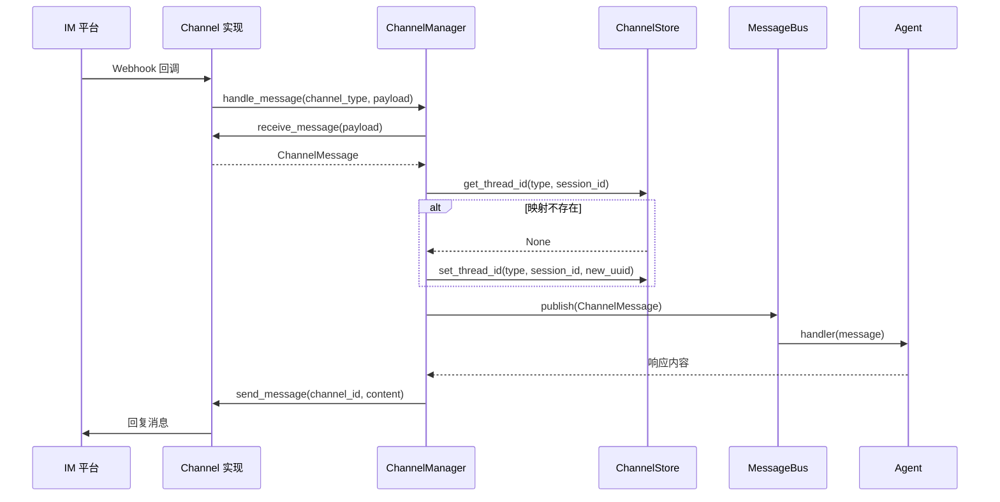

# IM 渠道桥接深度分析

## 1. 功能概述

IM 渠道桥接模块为 HN-Agent 提供飞书、Slack、Telegram 三个 IM 平台的消息桥接能力。核心组件包括：`Channel` 抽象基类（定义统一的消息解析/发送/Webhook 接口）、`ChannelManager`（核心调度器，管理多 Channel 注册和消息路由）、`MessageBus`（基于 asyncio.Queue 的异步消息总线，解耦 Channel 与 Agent）和 `ChannelStore`（基于 JSON 文件的会话映射持久化，将 IM 会话 ID 映射到 Agent 线程 ID）。

## 2. 核心流程图



## 3. 关键数据结构

```python
# 统一跨平台消息模型
@dataclass
class ChannelMessage:
    channel_type: str          # 渠道类型（feishu/slack/telegram）
    channel_session_id: str    # 平台会话 ID
    sender_id: str             # 发送者 ID
    content: str               # 消息内容
    attachments: list[Attachment]  # 附件列表
    timestamp: datetime        # 时间戳
    raw_payload: dict          # 原始 Webhook 载荷

# Channel 抽象基类
class Channel(ABC):
    channel_type: str          # 渠道类型标识
    receive_message(payload) -> ChannelMessage  # 解析 Webhook
    send_message(channel_id, content) -> None   # 发送消息
    setup_webhook(webhook_url) -> None          # 配置 Webhook
```

## 4. 设计决策分析

### 4.1 MessageBus 解耦
- 问题：Channel 和 Agent 之间的直接耦合
- 方案：asyncio.Queue 消息总线，Channel publish → handler subscribe
- Trade-off：引入异步队列增加了复杂度，但实现了 Channel 和 Agent 的完全解耦

### 4.2 原子 JSON 持久化
- 问题：会话映射需要持久化，进程重启后恢复
- 方案：`ChannelStore` 使用 tempfile + os.replace 原子写入 JSON
- Trade-off：每次映射变更都写入文件，高频场景有 I/O 开销

## 5. 关键代码位置索引

| 文件 | 关键内容 |
|------|---------|
| `app/channels/base.py` | Channel ABC + ChannelMessage/Attachment |
| `app/channels/manager.py` | ChannelManager 核心调度器 |
| `app/channels/message_bus.py` | MessageBus 异步消息总线 |
| `app/channels/store.py` | ChannelStore JSON 持久化 |
| `app/channels/feishu.py` | 飞书 Channel 实现 |
| `app/channels/slack.py` | Slack Channel 实现 |
| `app/channels/telegram.py` | Telegram Channel 实现 |
