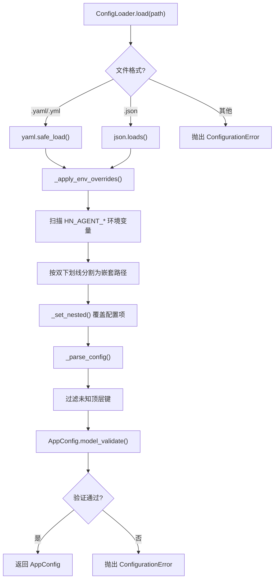

# 配置系统深度分析

## 1. 功能概述

配置系统为 HN-Agent 提供统一的配置加载和验证机制。`ConfigLoader` 支持从 YAML/JSON 文件加载配置，并用 `HN_AGENT_` 前缀的环境变量覆盖（双下划线分隔嵌套层级）。所有配置模型基于 Pydantic v2 `BaseModel`，提供类型验证和 JSON Schema 生成。顶层 `AppConfig` 聚合了 7 个子模块配置：AppSettings、ModelSettings、SandboxSettings、ToolSettings、MemorySettings、ExtensionsSettings、GuardrailSettings。

## 2. 核心流程图



## 3. 关键数据结构

```python
class AppConfig(BaseModel):
    app: AppSettings           # 应用基础设置（name, debug, host, port）
    model: ModelSettings       # 模型工厂配置（default_model, providers）
    sandbox: SandboxSettings   # 沙箱配置（provider, timeout, work_dir）
    tool: ToolSettings         # 工具配置（builtin_enabled, community_tools）
    memory: MemorySettings     # 记忆配置（enabled, debounce_seconds, vector_store）
    extensions: ExtensionsSettings  # 扩展配置
    guardrails: GuardrailSettings   # 护栏配置（enabled, provider, rules）
    version: str = "1.0"

# 环境变量覆盖规则
# HN_AGENT_APP__DEBUG=true → config["app"]["debug"] = "true"
# HN_AGENT_MODEL__PROVIDERS__OPENAI__API_KEY=sk-xxx → config["model"]["providers"]["openai"]["api_key"] = "sk-xxx"
```

## 4. 关键代码位置索引

| 文件 | 关键内容 |
|------|---------|
| `hn_agent/config/loader.py` | ConfigLoader 加载器（YAML/JSON + 环境变量覆盖） |
| `hn_agent/config/models.py` | Pydantic 配置模型（AppConfig + 7 个子配置） |
