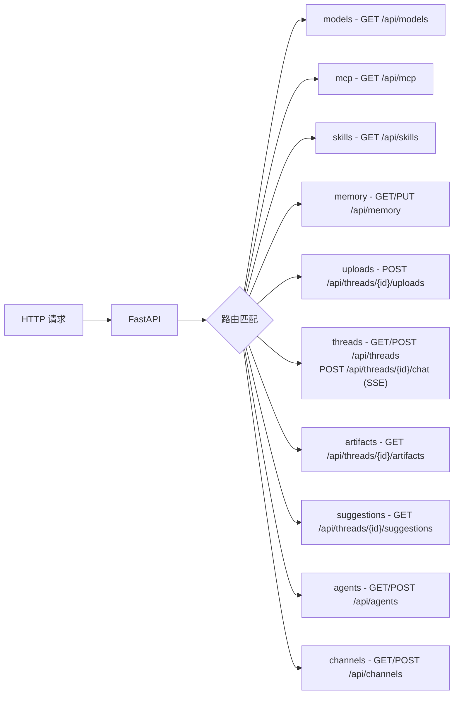

# Gateway API 深度分析

## 1. 功能概述

Gateway API 是 HN-Agent 的 HTTP 入口层，基于 FastAPI 构建，提供 10 个 RESTful 路由模块。`create_app` 工厂函数创建 FastAPI 实例，配置 CORS 中间件并注册所有路由。核心路由 `/api/threads/{id}/chat` 通过 SSE（Server-Sent Events）提供流式响应。Gateway 配置（端口、CORS、API 前缀）通过 `GatewayConfig` Pydantic 模型管理。

## 2. 核心流程图



## 3. 核心调用链

```
create_app(config)                               # app/gateway/app.py
  → FastAPI(title, description, version, debug)
  → CORSMiddleware(allow_origins, ...)
  → _register_routers(app)                       # 注册 10 个路由模块
      → app.include_router(threads_router)       # app/gateway/routers/threads.py
      → app.include_router(models_router)        # app/gateway/routers/models.py
      → ...

POST /api/threads/{id}/chat:
  → chat(thread_id, ChatRequest)                 # app/gateway/routers/threads.py
  → is_valid_thread_id(thread_id)                # app/gateway/path_utils.py
  → EventSourceResponse(event_generator())       # SSE 流式响应
```

## 4. 10 个路由模块

| 路由模块 | 路径 | 方法 | 功能 |
|---------|------|------|------|
| models | `/api/models` | GET | 获取可用模型列表 |
| mcp | `/api/mcp` | GET | 获取 MCP 服务器状态 |
| skills | `/api/skills` | GET | 获取已加载技能列表 |
| memory | `/api/memory` | GET, PUT | 查看/更新记忆 |
| uploads | `/api/threads/{id}/uploads` | POST | 上传文件到线程 |
| threads | `/api/threads`, `/api/threads/{id}/chat` | GET, POST | 线程管理 + SSE 聊天 |
| artifacts | `/api/threads/{id}/artifacts` | GET | 获取线程 artifact |
| suggestions | `/api/threads/{id}/suggestions` | GET | 获取建议回复 |
| agents | `/api/agents` | GET, POST | Agent 管理 |
| channels | `/api/channels` | GET, POST | 渠道管理 |

## 5. 关键代码位置索引

| 文件 | 关键内容 |
|------|---------|
| `app/gateway/app.py` | FastAPI 应用入口 + 路由注册 |
| `app/gateway/config.py` | GatewayConfig + CORSConfig |
| `app/gateway/path_utils.py` | 路径工具（thread_id 验证/生成） |
| `app/gateway/routers/threads.py` | 线程管理 + SSE 聊天路由 |
| `app/gateway/routers/` | 10 个路由模块 |
