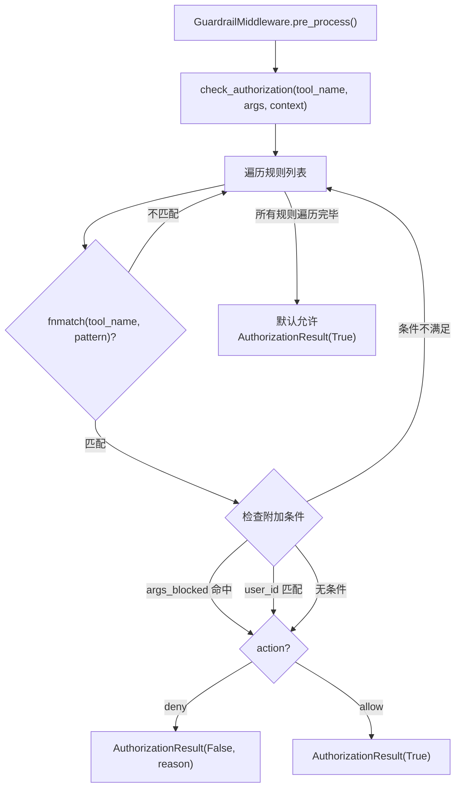

# 护栏系统深度分析

## 1. 功能概述

护栏系统为 HN-Agent 提供可插拔的工具调用授权检查机制。通过 `GuardrailProvider` Protocol 定义统一接口，内置 `RuleBasedGuardrailProvider` 基于配置规则（fnmatch 通配符匹配 + 附加条件）进行授权决策。规则按列表顺序逐条评估，首条匹配的规则决定结果，无规则匹配时默认允许。

## 2. 核心流程图



## 3. 关键数据结构

```python
@dataclass
class GuardrailRule:
    tool_pattern: str          # fnmatch 通配符模式（如 "bash*", "sandbox.*"）
    action: str                # "allow" 或 "deny"
    conditions: dict           # 附加条件（args_blocked, user_id 等）

@dataclass
class AuthorizationResult:
    authorized: bool           # 是否授权
    reason: str | None         # 拒绝原因

@dataclass
class GuardrailContext:
    thread_id: str             # 线程 ID
    user_id: str               # 用户 ID
    agent_id: str              # Agent ID
    metadata: dict             # 扩展元数据
```

## 4. 关键代码位置索引

| 文件 | 关键内容 |
|------|---------|
| `hn_agent/guardrails/provider.py` | GuardrailProvider Protocol + 数据模型 |
| `hn_agent/guardrails/builtin.py` | RuleBasedGuardrailProvider 规则引擎 |
