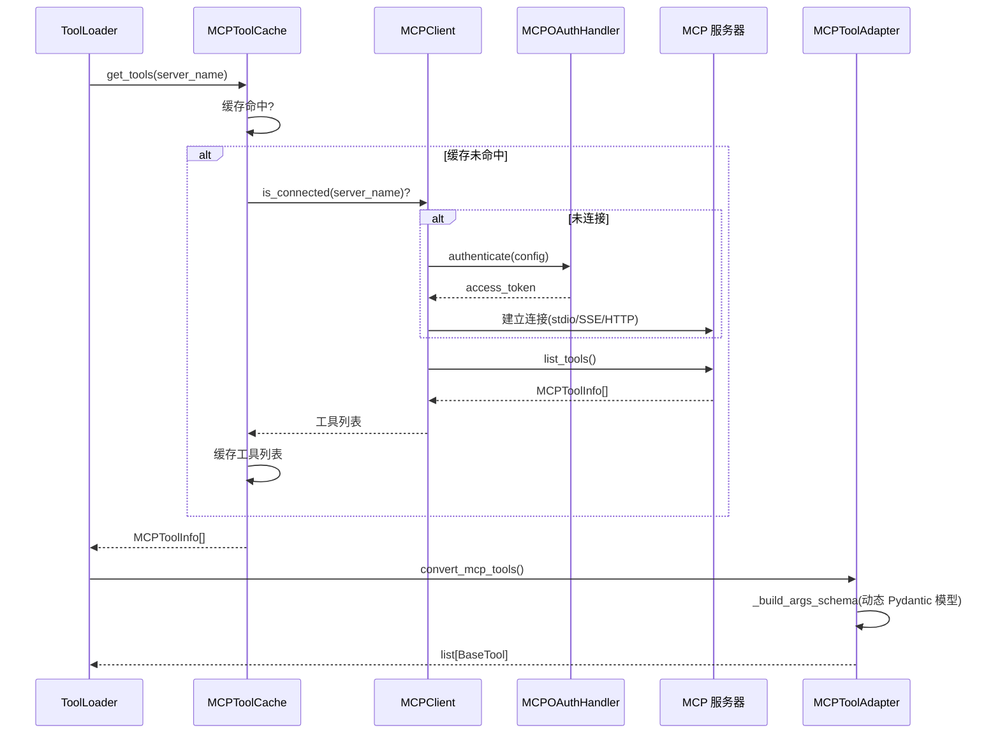

# MCP 集成深度分析

## 1. 功能概述

MCP（Model Context Protocol）集成模块为 HN-Agent 提供与外部 MCP 服务器的连接和工具调用能力。核心组件包括：`MCPClient`（多服务器连接管理，支持 stdio/SSE/HTTP 三种传输协议）、`MCPToolCache`（懒加载工具缓存，首次请求时自动连接并缓存）、`MCPToolAdapter`（将 MCP 工具转换为 LangChain BaseTool）和 `MCPOAuthHandler`（OAuth 认证处理）。模块通过动态构建 Pydantic 模型将 MCP 工具的 JSON Schema 参数映射为 LangChain 可理解的工具接口。

## 2. 核心流程图



## 3. 核心调用链

```
MCPToolCache.get_tools(server_name)              # hn_agent/mcp/cache.py
  → _load_tools(server_name)                     # 懒加载
      → MCPClient.connect(config)                # hn_agent/mcp/client.py
          → _connect_stdio/sse/http()            # 传输协议连接
      → MCPClient.list_tools(server_name)        # 获取工具列表
  → 缓存到 _cache[server_name]

convert_mcp_tools(tools, server_name, client)    # hn_agent/mcp/tools.py
  → _build_args_schema(tool_info)                # 动态构建 Pydantic 模型
      → create_model(name, **field_definitions)  # Pydantic create_model
  → MCPToolAdapter(name, description, schema)    # 适配为 BaseTool
```

## 4. 关键数据结构

```python
class MCPServerConfig:
    name: str                  # 服务器名称
    transport: str             # stdio | sse | http
    command: str | None        # stdio 模式启动命令
    url: str | None            # SSE/HTTP 模式 URL
    oauth: OAuthConfig | None  # OAuth 认证配置
    retry_interval: float      # 重试间隔（秒）
    max_retries: int           # 最大重试次数

class MCPToolInfo:
    name: str                  # 工具名称
    description: str           # 工具描述
    parameters: dict           # JSON Schema 参数定义
```

## 5. 设计决策分析

### 5.1 懒加载 + 双重检查锁
- 问题：多个并发请求可能同时触发服务器连接
- 方案：`MCPToolCache` 使用 `asyncio.Lock` + 双重检查避免重复连接
- Trade-off：首次请求有连接延迟，但后续请求零开销

### 5.2 动态 Pydantic 模型
- 问题：MCP 工具参数是运行时 JSON Schema，无法静态定义
- 方案：`create_model()` 动态构建 Pydantic 模型
- Trade-off：运行时构建有性能开销，但只在工具加载时执行一次

## 6. 关键代码位置索引

| 文件 | 关键内容 |
|------|---------|
| `hn_agent/mcp/client.py` | MCPClient 多服务器连接管理 |
| `hn_agent/mcp/cache.py` | MCPToolCache 懒加载缓存 |
| `hn_agent/mcp/tools.py` | MCPToolAdapter + convert_mcp_tools |
| `hn_agent/mcp/oauth.py` | MCPOAuthHandler OAuth 认证 |
