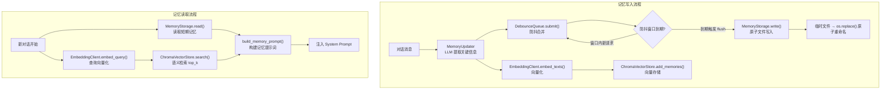

# 记忆系统深度分析

## 1. 功能概述

记忆系统为 HN-Agent 提供双层记忆架构：短期记忆（基于原子文件 I/O 的用户级文本存储）和长期记忆（基于 ChromaDB 的向量化语义存储与检索）。系统通过 `MemoryUpdater` 使用 LLM 从对话中提取关键信息，经 `DebounceQueue` 防抖合并后写入存储。新对话开始时，通过 `EmbeddingClient` 将用户消息向量化，在 `ChromaVectorStore` 中进行语义检索，将相关记忆注入系统提示词。

## 2. 核心流程图



## 3. 核心调用链

```
记忆写入:
  MemoryMiddleware.post_process()                # hn_agent/agents/middlewares/memory.py
    → MemoryUpdater.extract_and_update(msgs, existing)  # hn_agent/memory/updater.py
        → LLM.ainvoke(extraction_prompt)         # LLM 提取关键信息
    → DebounceQueue.submit(thread_id, messages)  # hn_agent/memory/queue.py
        → _delayed_flush(thread_id)              # 防抖等待
        → flush(thread_id)                       # 触发处理
    → MemoryStorage.write(user_id, content)      # hn_agent/memory/storage.py
        → tempfile.mkstemp() → os.replace()      # 原子写入
    → EmbeddingClient.embed_texts(texts)         # hn_agent/memory/embedding.py
    → ChromaVectorStore.add_memories(chunks)     # hn_agent/memory/vector_store.py

记忆读取:
  MemoryMiddleware.pre_process()                 # hn_agent/agents/middlewares/memory.py
    → MemoryStorage.read(user_id)                # 短期记忆
    → EmbeddingClient.embed_query(query)         # 查询向量化
    → ChromaVectorStore.search(query, top_k)     # 语义检索
    → build_memory_prompt(short, long)           # hn_agent/memory/prompt.py
```

## 4. 关键数据结构

```python
# 向量化记忆片段
@dataclass
class MemoryChunk:
    id: str                    # 记忆 ID
    content: str               # 记忆文本内容
    user_id: str               # 用户 ID
    thread_id: str             # 线程 ID
    embedding: list[float]     # 嵌入向量
    created_at: datetime       # 创建时间
    metadata: dict             # 扩展元数据

# 防抖队列内部状态
@dataclass
class _PendingUpdate:
    thread_id: str             # 线程 ID
    messages: list[Any]        # 合并的消息列表
    timestamp: float           # 最后更新时间戳

# 记忆提示词格式
"<short_term_memory>...</short_term_memory>"
"<long_term_memory>...</long_term_memory>"
```

## 5. 设计决策分析

### 5.1 双层记忆架构

- 问题：如何平衡记忆的即时性和持久性
- 方案：短期记忆（文件）+ 长期记忆（向量数据库）
- 原因：短期记忆读写快、无依赖；长期记忆支持语义检索，跨对话持久化
- Trade-off：两层存储增加了系统复杂度，需要同步维护

### 5.2 原子文件写入

- 问题：进程中断可能导致记忆文件损坏
- 方案：写入临时文件 → `os.replace()` 原子重命名
- 原因：`os.replace` 在同一文件系统上是原子操作，保证数据完整性
- Trade-off：每次写入都创建临时文件，有额外 I/O 开销

### 5.3 防抖合并

- 问题：高频对话会产生大量 LLM 记忆提取请求
- 方案：`DebounceQueue` 在可配置的时间窗口（默认 5s）内合并多次请求
- 原因：减少不必要的 LLM 调用，降低成本和延迟
- Trade-off：引入了延迟（最多 debounce_seconds），记忆更新不是实时的

### 5.4 LLM 驱动的记忆提取

- 问题：如何从对话中提取有价值的记忆
- 方案：`MemoryUpdater` 使用 LLM 分析对话，提取用户偏好、关键事实等
- 原因：LLM 能理解语义，比规则引擎更灵活
- Trade-off：依赖 LLM 质量，有额外的 API 调用成本

## 6. 错误处理策略

| 场景 | 处理方式 |
|------|---------|
| LLM 记忆提取失败 | 保留现有记忆，记录 exception |
| 记忆文件读取失败 | 返回空字符串，记录 exception |
| 原子写入失败 | 清理临时文件，保留旧数据 |
| ChromaDB 初始化失败 | 抛出 `VectorStoreError` |
| 嵌入向量生成失败 | 抛出 `VectorStoreError` |
| ChromaDB 查询失败 | 抛出 `VectorStoreError` |
| 防抖处理回调失败 | 记录 exception，不影响后续请求 |
| LLM 未配置 | 直接返回现有记忆（降级） |

## 7. 关键代码位置索引

| 文件 | 关键内容 |
|------|---------|
| `hn_agent/memory/updater.py` | MemoryUpdater LLM 驱动的记忆提取 |
| `hn_agent/memory/queue.py` | DebounceQueue 防抖合并队列 |
| `hn_agent/memory/storage.py` | MemoryStorage 原子文件 I/O |
| `hn_agent/memory/vector_store.py` | ChromaVectorStore 向量存储与语义检索 |
| `hn_agent/memory/embedding.py` | EmbeddingClient 嵌入模型封装 |
| `hn_agent/memory/prompt.py` | MemoryChunk 数据模型 + build_memory_prompt |
