# 中间件链深度分析

## 1. 功能概述

中间件链是 HN-Agent 的请求处理管道，由 14 个有序中间件组成，在 Agent 推理前后分别执行预处理（正序）和后处理（逆序）。每个中间件实现 `Middleware` Protocol 的 `pre_process` 和 `post_process` 方法，通过 `MiddlewareChain` 管理器统一调度。中间件覆盖了线程数据加载、文件注入、沙箱管理、授权检查、历史摘要、记忆注入、循环检测、Token 统计等横切关注点，是 Agent 引擎的核心扩展机制。

## 2. 核心流程图

```mermaid
flowchart TD
    A["用户请求"] --> B["MiddlewareChain.run_pre()"]

    subgraph 预处理_正序
        B --> M1["① ThreadData<br/>加载线程数据"]
        M1 --> M2["② Uploads<br/>注入上传文件"]
        M2 --> M3["③ Sandbox<br/>创建沙箱"]
        M3 --> M4["④ DanglingToolCall<br/>检测未完成调用"]
        M4 --> M5["⑤ Guardrail<br/>授权检查"]
        M5 --> M6["⑥ Summarization<br/>历史摘要压缩"]
        M6 --> M7["⑦ TodoList<br/>任务列表维护"]
        M7 --> M8["⑧ Title<br/>(预处理跳过)"]
        M8 --> M9["⑨ Memory<br/>注入记忆上下文"]
        M9 --> M10["⑩ ViewImage<br/>(预处理跳过)"]
        M10 --> M11["⑪ SubagentLimit<br/>限制并发"]
        M11 --> M12["⑫ Clarification<br/>检测澄清需求"]
        M12 --> M13["⑬ LoopDetection<br/>检测推理循环"]
        M13 --> M14["⑭ TokenUsage<br/>(预处理跳过)"]
    end

    M14 --> C["Lead Agent 推理<br/>(LLM + 工具调用循环)"]

    C --> D["MiddlewareChain.run_post()"]

    subgraph 后处理_逆序
        D --> P14["⑭ TokenUsage<br/>统计 Token"]
        P14 --> P13["⑬ LoopDetection"]
        P13 --> P12["⑫ Clarification"]
        P12 --> P11["⑪ SubagentLimit"]
        P11 --> P10["⑩ ViewImage<br/>处理图片"]
        P10 --> P9["⑨ Memory<br/>提交记忆更新"]
        P9 --> P8["⑧ Title<br/>生成对话标题"]
        P8 --> P7["⑦ TodoList"]
        P7 --> P6["⑥ Summarization"]
        P6 --> P5["⑤ Guardrail"]
        P5 --> P4["④ DanglingToolCall"]
        P4 --> P3["③ Sandbox<br/>清理沙箱"]
        P3 --> P2["② Uploads"]
        P2 --> P1["① ThreadData"]
    end

    P1 --> E["返回响应"]
```



## 3. 核心调用链

```
MiddlewareChain.run_pre(state, config)           # hn_agent/agents/middlewares/chain.py
  → ThreadDataMiddleware.pre_process()            # hn_agent/agents/middlewares/thread_data.py
  → UploadsMiddleware.pre_process()               # hn_agent/agents/middlewares/uploads.py
  → SandboxMiddleware.pre_process()               # hn_agent/agents/middlewares/sandbox.py
  → DanglingToolCallMiddleware.pre_process()      # hn_agent/agents/middlewares/dangling_tool_call.py
  → GuardrailMiddleware.pre_process()             # hn_agent/agents/middlewares/guardrail.py
  → SummarizationMiddleware.pre_process()         # hn_agent/agents/middlewares/summarization.py
  → TodoListMiddleware.pre_process()              # hn_agent/agents/middlewares/todolist.py
  → TitleMiddleware.pre_process()                 # (no-op)
  → MemoryMiddleware.pre_process()                # hn_agent/agents/middlewares/memory.py
  → ViewImageMiddleware.pre_process()             # (no-op)
  → SubagentLimitMiddleware.pre_process()         # hn_agent/agents/middlewares/subagent_limit.py
  → ClarificationMiddleware.pre_process()         # hn_agent/agents/middlewares/clarification.py
  → LoopDetectionMiddleware.pre_process()         # hn_agent/agents/middlewares/loop_detection.py
  → TokenUsageMiddleware.pre_process()            # (no-op)

--- Agent 推理 ---

MiddlewareChain.run_post(state, config)           # hn_agent/agents/middlewares/chain.py
  → TokenUsageMiddleware.post_process()           # 统计 Token
  → LoopDetectionMiddleware.post_process()        # (no-op)
  → ...（逆序执行）
  → SandboxMiddleware.post_process()              # 清理沙箱
  → UploadsMiddleware.post_process()              # (no-op)
  → ThreadDataMiddleware.post_process()           # (no-op)
```

## 4. 关键数据结构

```python
# 中间件协议（Protocol）
@runtime_checkable
class Middleware(Protocol):
    async def pre_process(self, state: dict[str, Any], config: dict[str, Any]) -> dict[str, Any]: ...
    async def post_process(self, state: dict[str, Any], config: dict[str, Any]) -> dict[str, Any]: ...

# 中间件链管理器
class MiddlewareChain:
    middlewares: list[Middleware]       # 有序中间件列表
    run_pre(state, config)             # 正序执行预处理
    run_post(state, config)            # 逆序执行后处理

# 默认中间件执行顺序
DEFAULT_MIDDLEWARE_ORDER: list[type] = [
    ThreadDataMiddleware,      # 1. 加载线程数据
    UploadsMiddleware,         # 2. 注入上传文件
    SandboxMiddleware,         # 3. 创建/清理沙箱
    DanglingToolCallMiddleware,# 4. 检测未完成工具调用
    GuardrailMiddleware,       # 5. 授权检查
    SummarizationMiddleware,   # 6. 历史摘要压缩
    TodoListMiddleware,        # 7. 任务列表维护
    TitleMiddleware,           # 8. 生成对话标题（仅后处理）
    MemoryMiddleware,          # 9. 记忆注入/提交
    ViewImageMiddleware,       # 10. 图片处理（仅后处理）
    SubagentLimitMiddleware,   # 11. 子 Agent 并发限制
    ClarificationMiddleware,   # 12. 澄清需求检测
    LoopDetectionMiddleware,   # 13. 推理循环检测
    TokenUsageMiddleware,      # 14. Token 用量统计（仅后处理）
]
```

## 5. 14 个中间件职责详解

| # | 中间件 | 预处理职责 | 后处理职责 | 实现状态 |
|---|--------|-----------|-----------|---------|
| 1 | ThreadDataMiddleware | 从持久化存储加载线程关联数据 | — | TODO |
| 2 | UploadsMiddleware | 从 UploadManager 获取文件内容并注入消息上下文 | — | TODO |
| 3 | SandboxMiddleware | 创建沙箱实例 | 清理沙箱资源 | TODO |
| 4 | DanglingToolCallMiddleware | 检测 messages 中未完成的 tool_call，防止状态不一致 | — | TODO |
| 5 | GuardrailMiddleware | 调用 GuardrailProvider 进行工具调用授权检查 | — | TODO |
| 6 | SummarizationMiddleware | 对话超过长度阈值时调用 LLM 进行历史摘要压缩 | — | TODO |
| 7 | TodoListMiddleware | 加载和维护 Agent 的任务列表状态 | — | TODO |
| 8 | TitleMiddleware | — | 调用 LLM 为新对话线程自动生成标题 | TODO |
| 9 | MemoryMiddleware | 从 MemorySystem 检索相关记忆并注入上下文 | 将对话内容提交到记忆更新队列 | TODO |
| 10 | ViewImageMiddleware | — | 处理 Agent 生成的图片数据，注入线程状态 | TODO |
| 11 | SubagentLimitMiddleware | 检查当前并发子 Agent 数量，防止资源耗尽 | — | TODO |
| 12 | ClarificationMiddleware | 检测 Agent 是否需要向用户请求澄清信息 | — | TODO |
| 13 | LoopDetectionMiddleware | 检测重复动作模式，在循环时终止推理 | — | TODO |
| 14 | TokenUsageMiddleware | — | 统计并记录本次推理的 Token 使用量 | TODO |

> 注：当前所有中间件均为骨架实现（TODO），核心逻辑待后续填充。

## 6. 设计决策分析

### 6.1 Protocol 而非 ABC

- 问题：如何定义中间件接口
- 方案：使用 `typing.Protocol` + `@runtime_checkable` 而非 `abc.ABC`
- 原因：Protocol 支持结构化子类型（鸭子类型），中间件无需显式继承基类
- Trade-off：运行时类型检查性能略低于 isinstance(ABC)，但提供了更灵活的组合方式

### 6.2 固定顺序 + 正序/逆序执行

- 问题：中间件之间存在依赖关系（如沙箱必须在护栏之前创建）
- 方案：`DEFAULT_MIDDLEWARE_ORDER` 定义固定顺序，预处理正序、后处理逆序
- 原因：逆序后处理确保资源清理的对称性（先创建的后清理）
- Trade-off：顺序硬编码，新增中间件需要仔细考虑插入位置

### 6.3 state 透传模式

- 问题：中间件如何与 Agent 状态交互
- 方案：每个中间件接收 `state: dict` 和 `config: dict`，返回修改后的 state
- 原因：函数式管道模式，每个中间件可以独立修改状态
- Trade-off：所有中间件共享同一个 state 字典，需要约定键名避免冲突

## 7. 错误处理策略

当前中间件链没有内置错误处理机制。`MiddlewareChain.run_pre/run_post` 中任何中间件抛出异常都会直接传播到调用方。建议后续实现中考虑：
- 单个中间件失败是否应该跳过（降级）还是终止整个管道
- 后处理阶段的清理逻辑（如沙箱清理）应该保证执行

## 8. 关键代码位置索引

| 文件 | 关键内容 |
|------|---------|
| `hn_agent/agents/middlewares/base.py` | Middleware Protocol 定义 |
| `hn_agent/agents/middlewares/chain.py` | MiddlewareChain 管理器（run_pre/run_post） |
| `hn_agent/agents/middlewares/__init__.py` | DEFAULT_MIDDLEWARE_ORDER 顺序定义 + create_default_chain |
| `hn_agent/agents/middlewares/thread_data.py` | #1 线程数据加载 |
| `hn_agent/agents/middlewares/uploads.py` | #2 上传文件注入 |
| `hn_agent/agents/middlewares/sandbox.py` | #3 沙箱生命周期管理 |
| `hn_agent/agents/middlewares/dangling_tool_call.py` | #4 未完成工具调用检测 |
| `hn_agent/agents/middlewares/guardrail.py` | #5 授权检查 |
| `hn_agent/agents/middlewares/summarization.py` | #6 历史摘要压缩 |
| `hn_agent/agents/middlewares/todolist.py` | #7 任务列表维护 |
| `hn_agent/agents/middlewares/title.py` | #8 对话标题生成 |
| `hn_agent/agents/middlewares/memory.py` | #9 记忆注入/提交 |
| `hn_agent/agents/middlewares/view_image.py` | #10 图片处理 |
| `hn_agent/agents/middlewares/subagent_limit.py` | #11 子 Agent 并发限制 |
| `hn_agent/agents/middlewares/clarification.py` | #12 澄清需求检测 |
| `hn_agent/agents/middlewares/loop_detection.py` | #13 推理循环检测 |
| `hn_agent/agents/middlewares/token_usage.py` | #14 Token 用量统计 |
