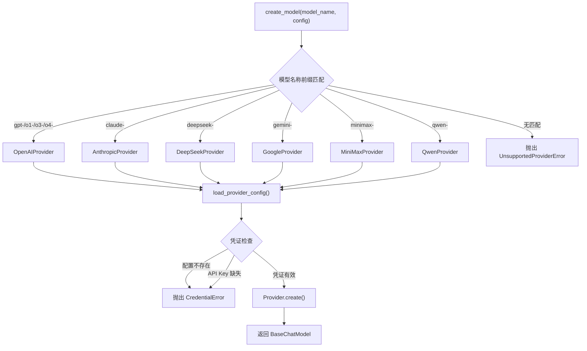

# 模型工厂深度分析

## 1. 功能概述

模型工厂是 HN-Agent 的 LLM 模型统一创建入口，通过模型名称前缀自动路由到对应的 Provider 适配器（OpenAI/Anthropic/DeepSeek/Google/MiniMax/Qwen），返回 LangChain `BaseChatModel` 实例。模块采用 Protocol 定义 Provider 接口，每个 Provider 封装对应 LangChain 集成库的初始化逻辑，并通过 `credential_loader` 统一管理 API 凭证的加载和验证。

## 2. 核心流程图



## 3. 核心调用链

```
create_model(model_name, config)                 # hn_agent/models/factory.py
  → _resolve_provider(model_name)                # 前缀匹配 → Provider 实例
  → provider.create(model_name, config, **kw)    # 各 Provider 实现
      → load_provider_config(name, config)       # hn_agent/models/credential_loader.py
      → ChatOpenAI(**params) / ChatAnthropic()   # LangChain 集成库
  → 返回 BaseChatModel
```

## 4. 关键数据结构

```python
# Provider 协议接口
class ModelProvider(Protocol):
    def create(self, model_name: str, config: ModelSettings, **kwargs: Any) -> BaseChatModel: ...

# 前缀 → Provider 映射表
_PREFIX_PROVIDER_MAP = {
    "gpt-": OpenAIProvider(),      # OpenAI GPT 系列
    "o1-": OpenAIProvider(),       # OpenAI o1 系列
    "o3-": OpenAIProvider(),       # OpenAI o3 系列
    "o4-": OpenAIProvider(),       # OpenAI o4 系列
    "claude-": AnthropicProvider(),# Anthropic Claude 系列
    "deepseek-": DeepSeekProvider(),
    "gemini-": GoogleProvider(),
    "minimax-": MiniMaxProvider(),
    "qwen-": QwenProvider(),
}

# 提供商配置
class ProviderConfig(BaseModel):
    api_key: str | None              # API 密钥
    api_base: str | None             # 自定义 API 端点
    extra: dict[str, Any]            # 扩展参数（thinking_params, default_params 等）
```

## 5. 设计决策分析

### 5.1 前缀路由策略

- 问题：如何根据模型名称选择正确的 Provider
- 方案：通过模型名称前缀（如 `gpt-`、`claude-`）匹配 Provider
- 原因：LLM 模型命名有明确的厂商前缀约定，前缀匹配简单高效
- Trade-off：新增 Provider 需要手动添加前缀映射；同一厂商的不同前缀需要多条映射（如 OpenAI 的 gpt-/o1-/o3-/o4-）

### 5.2 Protocol 而非继承

- 问题：如何定义 Provider 接口
- 方案：使用 `typing.Protocol` 定义 `ModelProvider`
- 原因：Provider 实现无需继承基类，只需满足 `create` 方法签名
- Trade-off：缺少基类的默认实现，但各 Provider 逻辑差异较大，基类复用价值有限

### 5.3 凭证集中验证

- 问题：API 凭证缺失时如何处理
- 方案：`load_provider_config` 统一检查配置存在性和 API Key 非空
- 原因：将凭证验证逻辑从各 Provider 中抽离，避免重复代码
- Trade-off：所有 Provider 共享相同的验证逻辑，无法处理特殊凭证需求（如 OAuth）

## 6. 错误处理策略

| 场景 | 异常类型 | 处理方式 |
|------|---------|---------|
| 模型名称无匹配前缀 | `UnsupportedProviderError` | 直接抛出，包含模型名称 |
| Provider 配置不存在 | `CredentialError` | 抛出，提示"未配置该提供商" |
| API Key 缺失 | `CredentialError` | 抛出，提示"API Key 缺失" |
| LangChain 初始化失败 | 各库原生异常 | 透传给调用方 |

## 7. 关键代码位置索引

| 文件 | 关键内容 |
|------|---------|
| `hn_agent/models/factory.py` | 模型工厂入口 `create_model`，前缀路由表 |
| `hn_agent/models/base_provider.py` | ModelProvider Protocol 定义 |
| `hn_agent/models/credential_loader.py` | 凭证加载与验证 |
| `hn_agent/models/openai_provider.py` | OpenAI Provider（ChatOpenAI） |
| `hn_agent/models/anthropic_provider.py` | Anthropic Provider（ChatAnthropic） |
| `hn_agent/models/deepseek_provider.py` | DeepSeek Provider |
| `hn_agent/models/google_provider.py` | Google Provider |
| `hn_agent/models/minimax_provider.py` | MiniMax Provider |
| `hn_agent/models/qwen_provider.py` | Qwen Provider |
