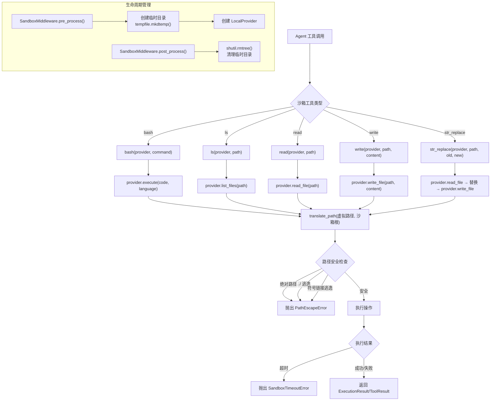

# 沙箱系统深度分析

## 1. 功能概述

沙箱系统为 HN-Agent 提供安全隔离的代码执行环境，支持 Local（本地文件系统隔离目录）和 Docker（容器化）两种 Provider。核心功能包括：在隔离环境中执行 Python/Bash 代码、文件读写操作、路径安全翻译（防止路径逃逸攻击）、超时控制，以及 5 个沙箱工具（bash/ls/read/write/str_replace）供 Agent 调用。沙箱生命周期由 `SandboxMiddleware` 管理，在 Agent 推理前创建临时目录，推理后清理资源。

## 2. 核心流程图



## 3. 核心调用链

```
SandboxMiddleware.pre_process()                  # hn_agent/sandbox/middleware.py
  → tempfile.mkdtemp(dir=work_dir)               # 创建临时沙箱目录
  → LocalProvider(sandbox_root, timeout)          # hn_agent/sandbox/local/provider.py

Agent 工具调用:
  bash(provider, command)                         # hn_agent/sandbox/tools.py
    → provider.execute(command, "bash", timeout)  # hn_agent/sandbox/local/provider.py
      → asyncio.create_subprocess_exec(cmd, cwd=sandbox_root)
      → asyncio.wait_for(proc.communicate(), timeout)

  read(provider, path)                            # hn_agent/sandbox/tools.py
    → provider.read_file(virtual_path)            # hn_agent/sandbox/local/provider.py
      → translate_path(virtual_path, sandbox_root)# hn_agent/sandbox/path_translator.py
      → Path(real_path).read_text()

SandboxMiddleware.post_process()                  # hn_agent/sandbox/middleware.py
  → shutil.rmtree(sandbox_dir)                    # 清理临时目录
```

## 4. 关键数据结构

```python
# 沙箱 Provider 协议
class SandboxProvider(Protocol):
    async def execute(self, code: str, language: str, timeout: int = 30) -> ExecutionResult: ...
    async def read_file(self, virtual_path: str) -> str: ...
    async def write_file(self, virtual_path: str, content: str) -> None: ...
    async def list_files(self, virtual_path: str = ".") -> list[FileInfo]: ...

# 代码执行结果
@dataclass
class ExecutionResult:
    success: bool          # 是否成功（exit_code == 0）
    stdout: str            # 标准输出
    stderr: str            # 标准错误
    exit_code: int         # 退出码
    duration: float        # 执行耗时（秒）

# 文件信息
@dataclass
class FileInfo:
    name: str              # 文件名
    path: str              # 相对于沙箱根的路径
    is_dir: bool           # 是否为目录
    size: int = 0          # 文件大小（字节）

# 工具执行结果
@dataclass
class ToolResult:
    success: bool          # 是否成功
    output: str            # 输出内容
    error: str = ""        # 错误信息
```

## 5. 设计决策分析

### 5.1 双 Provider 架构

- 问题：不同部署环境对隔离级别的需求不同
- 方案：Local Provider（开发/轻量）+ Docker Provider（生产/强隔离）
- 原因：本地沙箱启动快、无依赖，适合开发；Docker 提供进程级隔离，适合生产
- Trade-off：Docker Provider 当前为 stub 实现，Local Provider 的隔离仅限于文件系统级别

### 5.2 路径翻译器安全设计

- 问题：用户可能通过 `../`、绝对路径、符号链接逃逸沙箱
- 方案：`translate_path` 三重检查：拒绝绝对路径 → resolve() 消除 `../` → relative_to() 验证 → 符号链接目标验证
- 原因：路径逃逸是沙箱最常见的安全漏洞
- Trade-off：每次文件操作都需要路径翻译，有轻微性能开销

### 5.3 临时目录生命周期

- 问题：沙箱目录何时创建和清理
- 方案：`SandboxMiddleware` 在 pre_process 创建 `tempfile.mkdtemp()`，post_process 用 `shutil.rmtree()` 清理
- 原因：每次 Agent 推理使用独立的临时目录，避免状态泄漏
- Trade-off：频繁创建/删除目录有 I/O 开销，但保证了隔离性

## 6. 错误处理策略

| 场景 | 异常类型 | 处理方式 |
|------|---------|---------|
| 路径逃逸（绝对路径/../) | `PathEscapeError` | 直接抛出，阻止操作 |
| 符号链接逃逸 | `PathEscapeError` | 直接抛出，阻止操作 |
| 执行超时 | `SandboxTimeoutError` | kill 进程后抛出 |
| 不支持的语言 | — | 返回 `ExecutionResult(success=False)` |
| 文件不存在 | `FileNotFoundError` | 透传给调用方 |
| 工具执行异常 | — | 捕获后返回 `ToolResult(success=False, error=...)` |
| 清理失败 | — | `ignore_errors=True` 静默忽略 |

## 7. 关键代码位置索引

| 文件 | 关键内容 |
|------|---------|
| `hn_agent/sandbox/provider.py` | SandboxProvider Protocol + ExecutionResult/FileInfo |
| `hn_agent/sandbox/local/provider.py` | LocalProvider 本地沙箱实现 |
| `hn_agent/sandbox/docker/provider.py` | DockerAioProvider（stub） |
| `hn_agent/sandbox/path_translator.py` | translate_path 路径安全翻译 |
| `hn_agent/sandbox/tools.py` | 5 个沙箱工具（bash/ls/read/write/str_replace） |
| `hn_agent/sandbox/middleware.py` | SandboxMiddleware 生命周期管理 |
