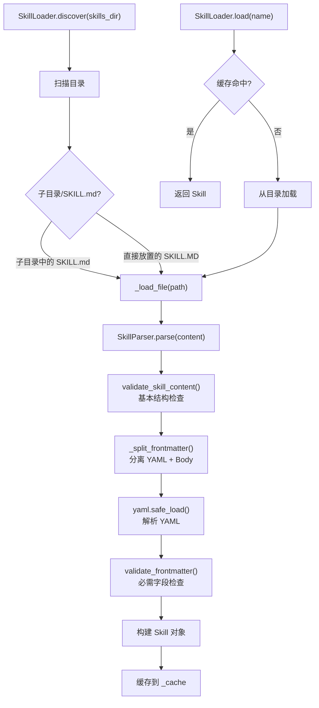

# 技能系统深度分析

## 1. 功能概述

技能系统为 HN-Agent 提供可扩展的能力注入机制，通过解析 SKILL.md 格式的 Markdown 文件（YAML frontmatter + Markdown body），将技能的描述、依赖工具和提示词内容加载为 `Skill` 对象，并在 Agent 创建时注入系统提示词。系统包含 `SkillLoader`（技能发现与加载）、`SkillParser`（SKILL.md 解析）和 `validation`（格式验证）三个核心组件。

## 2. 核心流程图



## 3. 关键数据结构

```python
@dataclass
class Skill:
    name: str              # 技能名称（唯一标识）
    description: str       # 技能描述
    dependencies: list[str]# 依赖的工具名称列表
    prompt: str            # 技能提示词（Markdown body）

# SKILL.md 格式
# ---
# name: skill-name
# description: 技能描述
# dependencies:
#   - tool_a
#   - tool_b
# ---
# Markdown body（作为 prompt 内容）
```

## 4. 设计决策分析

### 4.1 SKILL.md 格式
- 问题：如何定义技能的元数据和提示词
- 方案：YAML frontmatter（元数据）+ Markdown body（提示词）
- 原因：Markdown 是开发者熟悉的格式，frontmatter 是成熟的元数据方案
- Trade-off：解析逻辑需要处理 YAML + Markdown 两种格式

### 4.2 三层验证
- 结构验证（`validate_skill_content`）：检查 `---` 标记
- YAML 验证：`yaml.safe_load` 解析
- 字段验证（`validate_frontmatter`）：检查 name/description 必需字段

## 5. 关键代码位置索引

| 文件 | 关键内容 |
|------|---------|
| `hn_agent/skills/loader.py` | SkillLoader 发现与加载 |
| `hn_agent/skills/parser.py` | SkillParser SKILL.md 解析 |
| `hn_agent/skills/validation.py` | 格式验证（frontmatter + content） |
| `hn_agent/skills/types.py` | Skill 数据模型 |
