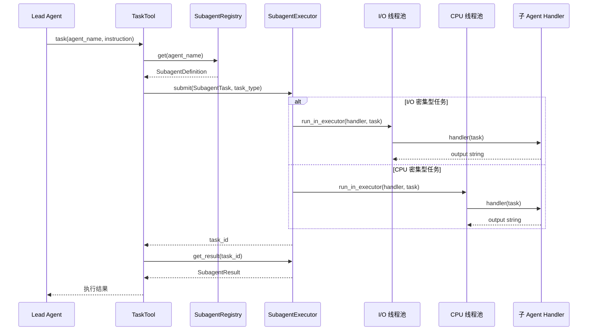

# 子 Agent 系统深度分析

## 1. 功能概述

子 Agent 系统为 HN-Agent 提供任务委派能力，允许主 Agent 将复杂子任务分发给专门的子 Agent 异步执行。系统由三个核心组件构成：`SubagentRegistry`（注册表，管理子 Agent 定义的注册和查找）、`SubagentExecutor`（双线程池执行器，分离 I/O 密集型和 CPU 密集型任务）和内置子 Agent（bash_agent 和 general_purpose）。主 Agent 通过 `TaskTool` 工具发起委派请求，执行器在独立线程池中运行子 Agent 处理函数。

## 2. 核心流程图



## 3. 核心调用链

```
TaskTool._run(agent_name, instruction, context)  # hn_agent/tools/builtins/task_tool.py
  → SubagentRegistry.get(agent_name)             # hn_agent/subagents/registry.py
  → SubagentTask.create(agent_name, ...)         # hn_agent/subagents/config.py
  → SubagentExecutor.submit(task, task_type)     # hn_agent/subagents/executor.py
      → loop.run_in_executor(pool, _execute, handler, task)
      → _execute(handler, task)                  # 在线程池中执行
          → handler(task)                        # 子 Agent 处理函数
          → SubagentResult(task_id, success, output)
  → SubagentExecutor.get_result(task_id)         # 等待结果
```

## 4. 关键数据结构

```python
# 任务类型枚举
class TaskType(str, Enum):
    IO = "io"              # I/O 密集型（网络请求、文件操作）
    CPU = "cpu"            # CPU 密集型（计算、数据处理）

# 子 Agent 定义
@dataclass
class SubagentDefinition:
    name: str              # 子 Agent 名称（唯一标识）
    description: str       # 功能描述
    task_type: TaskType    # 默认任务类型
    metadata: dict         # 扩展元数据

# 子 Agent 任务
@dataclass
class SubagentTask:
    task_id: str           # 任务 ID（uuid4）
    agent_name: str        # 目标子 Agent 名称
    instruction: str       # 任务指令
    parent_thread_id: str  # 父线程 ID
    context: dict          # 上下文数据
    created_at: datetime   # 创建时间

# 执行结果
@dataclass
class SubagentResult:
    task_id: str           # 任务 ID
    success: bool          # 是否成功
    output: str            # 输出内容
    error: str | None      # 错误信息
```

## 5. 设计决策分析

### 5.1 双线程池分离

- 问题：不同类型的子 Agent 任务对资源的需求不同
- 方案：I/O 线程池（4 workers）+ CPU 线程池（2 workers）
- 原因：I/O 密集型任务（如网络请求）可以高并发，CPU 密集型任务需要限制并发避免争抢
- Trade-off：线程池大小硬编码，无法根据负载动态调整

### 5.2 注册表模式

- 问题：如何管理可扩展的子 Agent 集合
- 方案：`SubagentRegistry` 提供 register/get/list 接口
- 原因：支持运行时动态注册新的子 Agent，不需要修改核心代码
- Trade-off：注册表是内存级的，重启后需要重新注册

### 5.3 Handler 函数式设计

- 问题：子 Agent 的执行逻辑如何定义
- 方案：`SubagentHandler = Callable[[SubagentTask], str]`，纯函数接口
- 原因：简单直接，易于测试，不需要复杂的类继承
- Trade-off：Handler 返回值仅为字符串，无法传递结构化数据

## 6. 错误处理策略

| 场景 | 处理方式 |
|------|---------|
| 未注册的子 Agent | `submit()` 抛出 `ValueError` |
| Handler 执行异常 | 捕获后返回 `SubagentResult(success=False, error=str(exc))` |
| 未知的 task_id | `get_result()` 抛出 `KeyError` |
| 线程池关闭 | `shutdown(wait=True)` 等待所有任务完成 |

## 7. 关键代码位置索引

| 文件 | 关键内容 |
|------|---------|
| `hn_agent/subagents/config.py` | SubagentDefinition/SubagentTask/SubagentResult 数据模型 |
| `hn_agent/subagents/registry.py` | SubagentRegistry 注册表 |
| `hn_agent/subagents/executor.py` | SubagentExecutor 双线程池执行器 |
| `hn_agent/subagents/builtins/bash_agent.py` | Bash 专家子 Agent |
| `hn_agent/subagents/builtins/general_purpose.py` | 通用子 Agent |
