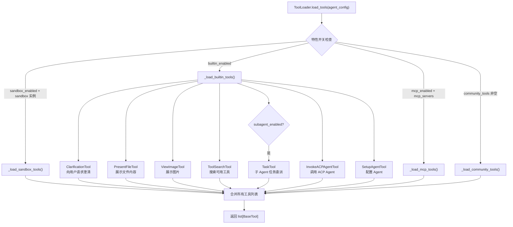

# 工具系统深度分析

## 1. 功能概述

工具系统是 HN-Agent 的能力扩展层，通过 `ToolLoader` 根据 Agent 配置动态加载四类工具：沙箱工具（代码执行）、内置工具（7 个 LangChain BaseTool）、MCP 工具（外部 MCP 服务器提供）和社区工具（Tavily/Jina/Firecrawl/DuckDuckGo）。所有工具统一实现 LangChain `BaseTool` 接口，通过 Pydantic `BaseModel` 定义输入 Schema，使 LLM 能够理解工具参数并正确调用。

## 2. 核心流程图



## 3. 核心调用链

```
ToolLoader.load_tools(agent_config)              # hn_agent/tools/loader.py
  → _load_sandbox_tools(sandbox)                 # 沙箱工具（占位）
  → _load_builtin_tools(features)                # 内置工具
      → ClarificationTool()                      # hn_agent/tools/builtins/clarification_tool.py
      → PresentFileTool()                        # hn_agent/tools/builtins/present_file_tool.py
      → ViewImageTool()                          # hn_agent/tools/builtins/view_image_tool.py
      → ToolSearchTool()                         # hn_agent/tools/builtins/tool_search.py
      → TaskTool()                               # hn_agent/tools/builtins/task_tool.py (条件加载)
      → InvokeACPAgentTool()                     # hn_agent/tools/builtins/invoke_acp_agent_tool.py
      → SetupAgentTool()                         # hn_agent/tools/builtins/setup_agent_tool.py
  → _load_mcp_tools(mcp_servers)                 # MCP 工具（占位）
  → _load_community_tools(tool_names)            # 社区工具（占位）
```

## 4. 关键数据结构

```python
# 工具加载器配置
@dataclass
class Features:
    sandbox_enabled: bool = True       # 是否加载沙箱工具
    memory_enabled: bool = True
    subagent_enabled: bool = True      # 是否加载 TaskTool
    guardrail_enabled: bool = True
    mcp_enabled: bool = True           # 是否加载 MCP 工具
    builtin_enabled: bool = True       # 是否加载内置工具

@dataclass
class AgentConfig:
    features: Features                 # 特性开关
    mcp_servers: list[str]             # MCP 服务器名称列表
    community_tools: list[str]         # 社区工具名称列表
    sandbox: Any = None                # SandboxProvider 实例

# 7 个内置工具
ClarificationTool    # 向用户请求澄清信息（question + options）
PresentFileTool      # 展示文件内容给用户
ViewImageTool        # 展示图片给用户
ToolSearchTool       # 搜索可用工具（query + category 过滤）
TaskTool             # 子 Agent 任务委派（agent_name + instruction + context）
InvokeACPAgentTool   # 调用 ACP 协议 Agent
SetupAgentTool       # 配置/创建 Agent
```

## 5. 设计决策分析

### 5.1 四类工具分层加载

- 问题：Agent 需要不同来源的工具能力
- 方案：按 sandbox → builtin → MCP → community 顺序加载
- 原因：沙箱工具最基础（代码执行），内置工具是核心能力，MCP/社区工具是扩展
- Trade-off：加载顺序固定，无法自定义优先级

### 5.2 特性开关控制

- 问题：不同场景需要不同的工具集
- 方案：通过 `Features` 布尔开关控制各类工具是否加载
- 原因：轻量场景可以关闭沙箱/MCP 等重量级工具
- Trade-off：粒度较粗（按类别开关），无法精确控制单个工具

### 5.3 统一 BaseTool 接口

- 问题：不同来源的工具需要统一接口
- 方案：所有工具实现 LangChain `BaseTool`，用 Pydantic `BaseModel` 定义输入 Schema
- 原因：LangGraph Agent 原生支持 BaseTool，LLM 可以通过 Schema 理解参数
- Trade-off：受限于 LangChain 工具框架，自定义能力有限

## 6. 错误处理策略

当前所有内置工具为桩实现（返回结构化字典），实际错误处理待后续集成。MCP 和社区工具的加载方法也为占位实现。

## 7. 关键代码位置索引

| 文件 | 关键内容 |
|------|---------|
| `hn_agent/tools/loader.py` | ToolLoader 动态加载器 |
| `hn_agent/tools/builtins/__init__.py` | 7 个内置工具导出 |
| `hn_agent/tools/builtins/clarification_tool.py` | 澄清工具 |
| `hn_agent/tools/builtins/present_file_tool.py` | 文件展示工具 |
| `hn_agent/tools/builtins/view_image_tool.py` | 图片展示工具 |
| `hn_agent/tools/builtins/tool_search.py` | 工具搜索工具 |
| `hn_agent/tools/builtins/task_tool.py` | 子 Agent 任务委派工具 |
| `hn_agent/tools/builtins/invoke_acp_agent_tool.py` | ACP Agent 调用工具 |
| `hn_agent/tools/builtins/setup_agent_tool.py` | Agent 配置工具 |
