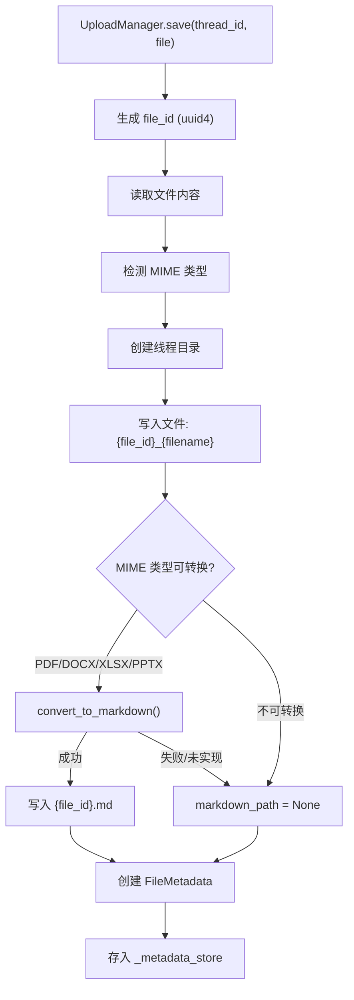

# 上传管理深度分析

## 1. 功能概述

上传管理模块负责用户文件的存储、元数据管理和文档格式转换。`UploadManager` 将上传文件保存到线程关联目录（`./data/uploads/{thread_id}/`），自动检测 MIME 类型，对支持的文档格式（PDF/DOCX/XLSX/PPTX 等）尝试转换为 Markdown 格式供 Agent 阅读。文件使用 UUID 前缀避免命名冲突，元数据存储在内存字典中。

## 2. 核心流程图



## 3. 关键数据结构

```python
@dataclass
class FileMetadata:
    file_id: str               # 文件唯一 ID
    filename: str              # 原始文件名
    size: int                  # 文件大小（字节）
    mime_type: str             # MIME 类型
    upload_time: datetime      # 上传时间
    markdown_path: str | None  # 转换后的 Markdown 文件路径

# 支持转换的 MIME 类型
CONVERTIBLE_MIME_TYPES = {
    "application/pdf": "pdf",
    "application/vnd.openxmlformats-officedocument.wordprocessingml.document": "docx",
    "application/vnd.openxmlformats-officedocument.spreadsheetml.sheet": "xlsx",
    "application/vnd.openxmlformats-officedocument.presentationml.presentation": "pptx",
    ...
}
```

## 4. 关键代码位置索引

| 文件 | 关键内容 |
|------|---------|
| `hn_agent/uploads/manager.py` | UploadManager 文件存储与格式转换 |
